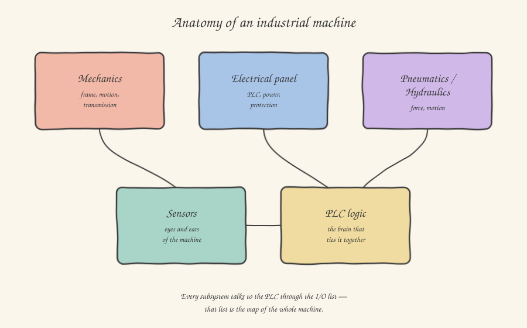

There's a moment, the first time you walk onto the shop floor for a commissioning job, when you realize that the code you wrote at home, on your PC, with its nice simulation environment, is only a small slice of what's in front of you. The PLC you're about to program is locked in a metal cabinet the size of a refrigerator, wired with hundreds of meters of cable to motors that weigh hundreds of kilograms, to pneumatic cylinders hissing compressed air, to sensors the size of a finger that have to say with absolute certainty whether a part is there or not. All of this together — moving, breathing, sometimes making a noise that puts you a little on edge — is the machine. And the software you write is just the nervous system of a much bigger body.

This first article doesn't go into the technical detail of any single component — we'll get there, one at a time, in the next ones. Instead, it's here to build the map: if you already know where everything sits and why it sits there, every detail you learn later will have a precise place to slot into, instead of remaining an isolated fact you read somewhere.

## The machine as a system, not a sum of parts

When a machine builder (the OEM, "Original Equipment Manufacturer", a term you'll hear constantly) designs a machine, they think of it as a system that has to transform something: raw material into finished product, a rough part into a machined one, scattered components into an assembly. To do this, the machine needs four fundamental capabilities, and each corresponds to a physical sub-system:

**Move.** Something has to push, lift, rotate, translate. This is the mechanical and electromechanical part: motors, belts, bearings, screws, guides. It's the machine's muscular and skeletal system.

**Generate force in an alternative way.** Not everything is worth moving with an electric motor. To clamp a part, push it, close a gripper, it's often much simpler and cheaper to use compressed air (pneumatics) or, for really large forces, pressurized oil (hydraulics). We'll dedicate several articles to this, because it's a huge world and, if you come from pure software, almost entirely new.

**Sense.** The machine has to know what's happening: has a part arrived? Is a cylinder fully out or fully in? Is the air pressure sufficient? This is the job of sensors — the machine's eyes, ears, and sense of touch.

**Decide and coordinate.** All the information gathered by the sensors has to turn into commands for the actuators (motors, valves, cylinders), following a logical sequence and, above all, safely. This is the job of the PLC and everything around it in the electrical panel.

Look at the diagram below: it's the map you'll keep in your head for this whole series of articles.



Notice one important thing in the diagram: every block converges on the PLC. That's not a stylistic detail. It's literally what happens in reality: sooner or later, every piece of information a sensor generates and every command an actuator receives passes through a terminal, a cable, an input or an output of the PLC. That's why, when you show up for commissioning with "the I/O list" in hand, that list isn't a dry set of acronyms — it's the translation, into bits and registers, of everything the machine is physically capable of doing and sensing.

## Why the I/O list is the machine's real map

Whoever writes the PLC software for machines designed by someone else usually receives two things: the functional specifications (what the machine has to do, in what sequence) and the I/O list (input/output — every sensor wired to an input, every actuator wired to an output, with its exact electrical address). If you look at that list with the right eyes, you're actually reading the machine's complete physical inventory.

A typical line might be:

```
I0.3   Sensor_ClampClosed_PNP_NO   24VDC digital input
Q0.5   Valve_Clamp_Extend          24VDC solenoid coil
```

From these two lines, without having seen the machine in person yet, you can already infer quite a lot: there's a cylinder (probably pneumatic, given the words "valve" and "coil" from solenoid valve) that operates a clamp or a gripping jaw; there's a sensor, probably inductive or magnetic, mounted on the cylinder itself or on the mechanism, telling you when the clamp is closed; the PLC output doesn't drive the cylinder directly, but the coil of a solenoid valve that in turn routes compressed air to the cylinder. Three levels of "physical translation" — PLC, solenoid valve, cylinder — behind a simple bit `Q0.5` that in your code you might just call `bClampExtend := TRUE`.

The whole point of this series is exactly this: to give you the physical intuition behind each of these steps, so that when you read `I0.3` or `Q0.5` in an I/O list, you really see the inductive sensor screwed onto the cylinder bracket and the solenoid valve clicking in the panel, not just an abstract symbol in a program.

## The road ahead

In the coming articles we'll go down, block by block, into each of these areas:

- The **electrical panel**: what's really inside that metal cabinet, how to read an electrical schematic, what distinguishes a contactor from a relay, why everything runs on 24VDC.
- **Sensors**: the practical difference between a PNP and an NPN output (which will make you swear the first time you get a wiring wrong), inductive, capacitive, and photoelectric sensors, encoders.
- **Motors and drives**: asynchronous motors, servomotors, inverters, and what actually changes for you as the person writing the control software.
- **Mechanical transmission**: belts, chains, ball screws — the minimum you need to understand why a machine is designed a certain way.
- **Pneumatics**, in three parts: air production and treatment, valves, cylinders.
- **Hydraulics**, for contrast and completeness.
- **Functional safety**, which in industry isn't optional but an entire way of designing.
- **Fieldbuses**, to understand why almost no modern machine wires every single sensor all the way back to the central PLC anymore.
- And finally a complete **case study**, where we'll put every piece together on a real — imaginary but plausible — machine, to see the whole reasoning applied from start to finish.

This isn't an academic path. The goal isn't for you to be able to size a pneumatic cylinder using the formulas from a mechanical engineering manual — for that, if you ever really need it, there are the manufacturers' technical catalogs, which we'll also learn to read. The goal is that the next time you're in front of an open panel or a control desk, you recognize what you're looking at, and understand *why* it was designed that way — why that valve is wired that way, why that sensor is inductive and not photoelectric, why that output goes through a relay instead of being driven directly by the PLC.

It's the same kind of understanding you already have, instinctively, for software: when you read well-written code, you don't just see instructions, you see the architectural decisions behind them. With this series, I want you to reach the point where you see the same kind of decisions behind the metal, the compressed air, and the cables of an electrical panel.

In the next article we open the cabinet: the electrical panel, component by component.
