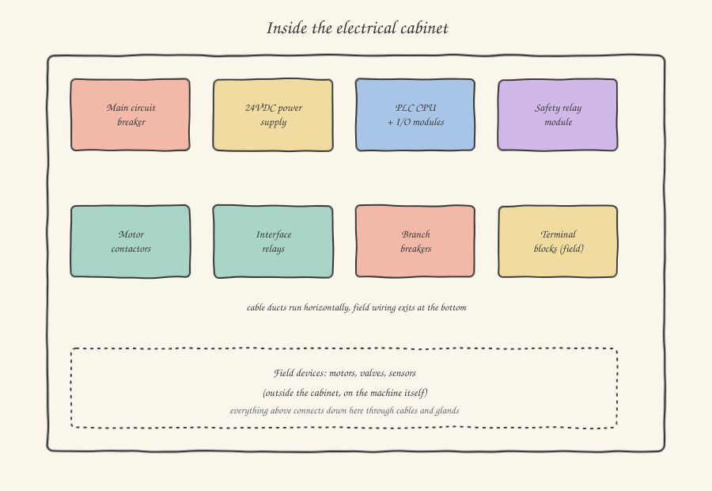

The first time you stand in front of an open industrial electrical panel, the impression is like looking inside a car engine without ever having taken apart a bicycle: grey components, cables numbered with white labels, a background hum, and somewhere in the middle of it all, small and almost unassuming compared to everything else, the PLC — the actual reason you're there. And yet that panel isn't chaos: it's one of the most standardized and predictable systems you'll ever come across, because it has to be. An electrician who has never seen that machine before has to be able to understand it in twenty minutes just by looking at the diagram, and the same goes for you.

In this article we'll break the panel down into its functional blocks. I won't teach you how to design one — that's a trade of its own, with dedicated standards (EN 60204-1 is the reference standard for the electrical safety of machinery, and you'll run into it often in technical files) — but how to *read* one, understanding why each block sits where it sits.

## The flow of energy, from the incoming supply to the field

The simplest way to find your bearings in a panel is to follow the path of the current, from top to bottom and left to right — that's almost always how electrical diagrams are drawn too, by convention.

**The main switch.** It's the first component you encounter, almost always top left, with a handle sticking out of the panel door: it's what the operator turns to "switch on" the machine in the morning, and what the maintenance technician locks with a padlock (the famous *lockout-tagout*, LOTO, a procedure we'll look at more closely when we talk about safety) before putting their hands inside the panel. Electrically it's a circuit breaker sized for the machine's total power: it protects everything downstream from short circuits and general overloads.

**The 24VDC power supply.** Here a fundamental transformation takes place that's worth understanding well, because it explains almost the entire logic of the rest of the panel. The industrial electrical grid typically arrives at 400V three-phase (in Europe) — a dangerous voltage, suited to driving large motors but completely unsuited to being handled by a PLC's digital input or by the contact of a cheap sensor. The power supply takes this alternating voltage and converts it into a low, safe direct voltage: **24V DC**. It's not an arbitrary value: it has become the de facto industrial standard because it's low enough to be considered "extra-low safety voltage" in many configurations (drastically limiting the risk of electric shock to the operator) but high enough to travel dozens of meters of cable without excessive voltage drop, and to supply enough current to drive relay and solenoid valve coils. Practically every sensor, every digital input and output of the PLC, every pneumatic solenoid valve coil you'll encounter runs on 24VDC. From now on, when you read `24VDC digital input` in an I/O list, you'll know exactly where that 24 comes from and why it's there.

**The PLC.** At the center of the panel, or at least in an easily accessible position for maintenance (often near a transparent door, so status LEDs can be seen without opening anything), you'll find the actual PLC: a CPU and a series of input/output modules clipped onto a DIN rail, the same metal bar to which practically all the panel's components are attached. Every terminal of every I/O module corresponds to a line in the I/O list you'll have received: it's the physical point where your `IF sensor THEN valve` software really becomes an electrical signal going in or out.

**The safety module.** Separated — almost always physically, and always logically — from the "normal" PLC (which is called a *safety* PLC in industry jargon when it also integrates safety functions, or remains a "standard" PLC flanked by a dedicated safety relay), it manages circuits that can never, under any circumstances, depend on software alone: the emergency stop button, safety light curtains, movable guard interlocks. We'll cover this in a dedicated article, because functional safety has a design logic all its own, with categories and performance levels codified by standard.

## Contactors, relays, and the question you'll keep asking yourself: "why doesn't the PLC drive it directly?"

A PLC digital output typically delivers a few hundred milliamps at 24VDC. A 5kW three-phase motor draws currents on the order of tens of amps at 400V. There's no way, either electrically or sensibly, to connect the PLC output directly to the motor: you'd need a switch capable of handling that current and voltage, controlled at low power by the PLC's signal. That switch is called a **contactor**: essentially, it's a power relay — a coil that, when energized at 24VDC (driven by the PLC output), mechanically closes contacts sized for much larger currents, allowing the motor to be fed from the power line.

An ordinary **relay** does exactly the same conceptual job — a low-power coil that closes contacts — but on a smaller scale: it's used to interface signals, multiply a contact (does one PLC input need to "read" the state of ten limit switches wired in series? A chain of relays makes that possible), or electrically isolate two circuits that must not touch each other directly. In practice, when you see a designation like `K1`, `K2` in a diagram, they're almost always contactors or relays: the letter K is the standardized IEC designation for these components (just as `Q` denotes circuit breakers, `S` push buttons and selector switches, `B` sensors — learning these designations will let you read any European electrical diagram much faster).

## Terminal blocks: the boundary between the panel and the machine

Everything we've seen so far lives inside the cabinet. But the real machine — the motors, cylinders, sensors — is outside, spread across the whole mechanical structure, sometimes over dozens of meters. The crossing point between "inside the panel" and "out in the field" is the **terminal blocks**: rows of numbered terminals where every cable leaving the panel finds a physical, uniquely identified connection point. Every terminal has a number that corresponds exactly to a line in the I/O list and a reference in the electrical diagram. When, during commissioning, you clip on a multimeter to check whether a sensor is actually switching, it's almost always on one of these terminals that you land the probes — because it's the most accessible and best-documented point in the entire wiring.

This is also why, the first time you receive a complete electrical diagram, it's worth printing it out (or keeping it open on a second monitor) and following it terminal by terminal alongside the I/O list: every line of your PLC program has, somewhere in that document, a precise physical path that runs from the sensor in the field, through a cable, to the terminal and the PLC module input. Seeing it all together, at least once, is what turns the sensor list from a set of acronyms into something you can actually picture while you write code.

In the next article we get into the detail of those sensors: what a PNP or NPN output really means, and why getting it wrong is the most classic wiring mistake anyone makes at least once.
