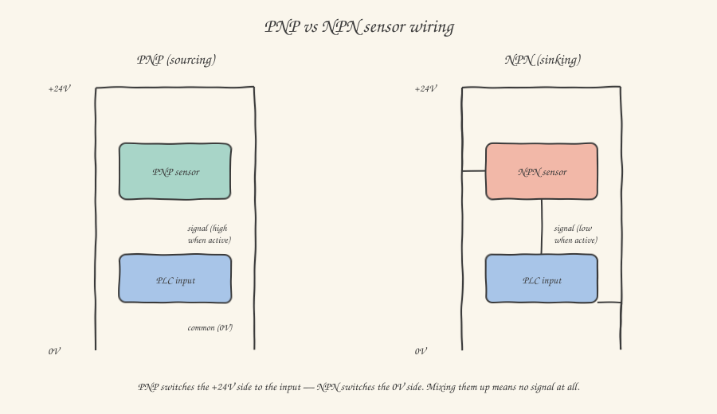

If there's one mistake that, sooner or later, everyone who works in the field makes — from the electrician to the fresh mechatronics graduate, and yes, you too — it's wiring a PNP sensor where an NPN was needed, or the other way around, and spending twenty minutes wondering why the PLC sees absolutely nothing while the sensor's LED is cheerfully blinking to say it's detecting something. It's not a silly mistake: it stems from a subtle concept, almost always explained badly, that I want to clear up for good today.

## A sensor isn't a switch, but it behaves like one

Start from a simple picture: an industrial proximity sensor — whether inductive, capacitive, or photoelectric, we'll see them in the next article — at its core does exactly what a wall switch does: it closes or opens an electrical contact in response to something (in the switch's case, your hand; in the sensor's case, the presence of an object). The difference is that a wall switch is a piece of metal you close mechanically yourself, while a sensor has a small electronic circuit inside that *simulates* closing a contact using a transistor as an electronic switch.

And this is exactly where the PNP/NPN distinction comes from: it depends on **which side of the circuit the sensor's transistor connects to the output**.

## PNP: the sensor "gives out" the positive

A **PNP** sensor (also called *sourcing*) connects its output to **+24V** of the supply when active. In practice, when the sensor detects the object, you find 24V on the output relative to ground. The PLC input, for its part, has to be configured (or more often, on modern PLCs, is wired) to recognize a high level on the input as "true", with the 0V reference tied to common.

## NPN: the sensor "sinks" to ground

An **NPN** sensor (also called *sinking*) does the exact opposite: when active, it connects its output to **0V** (ground). The PLC input in this case has to see a low level as "true", with +24V brought to common on the opposite side.

Look closely at the diagram: the physical difference is entirely there, in which sensor terminal — the signal one — gets pulled to +24V or to 0V when the sensor trips. If you wire a PNP sensor to a PLC input wired to receive NPN (that is, with common at +24V instead of 0V), the circuit simply never closes in the right direction: the input sees no useful level change, and as far as the PLC is concerned the sensor is "never active", even though it's physically detecting the object perfectly and its LED confirms it.

**A practical rule that will save you time in the field:** in Europe, for historical and regulatory reasons, the vast majority of industrial sensors and PLCs are wired in **PNP**. Unless stated otherwise in the I/O list or on the sensor's label, assume it's PNP — but always check, because in the automotive sector and in many plants of American or Asian origin you'll still find plenty of NPN, and the two worlds coexist more often than you'd expect, even within the same machine.

## Digital vs analog: a different question from PNP/NPN

PNP and NPN are about *how* a digital signal (on/off, present/absent) is carried electrically. But not all sensors give a binary answer. Many — think of a pressure sensor, a temperature sensor, or a linear position transducer — need to communicate a **continuous value**: not "there is pressure" but "the pressure is 3.7 bar". For this you need **analog** signals, and in the industrial world you'll essentially find two types, almost the same everywhere you go:

**4-20mA current.** The sensor drives a current through the circuit proportional to the measured quantity: 4mA corresponds to the minimum value of the scale (say, 0 bar), 20mA to the maximum value (say, 10 bar). It's the most widespread standard in heavy industry, and the reason is elegant from an engineering standpoint: being a current signal rather than a voltage one, it's unaffected by voltage drops along long cables (a serious problem when you're talking about dozens or hundreds of meters of wiring in a plant), and it's immune to most of the electromagnetic interference that plagues voltage signals instead. Notice a clever detail of the standard: the minimum value isn't 0mA but 4mA. This lets the PLC tell a genuinely zero value (4mA) apart from a broken cable or a disconnected sensor (0mA): a fault produces a recognizable out-of-range value instead of a silent error that looks like valid data.

**0-10V voltage.** Conceptually simpler — the sensor generates a voltage proportional to the measured quantity — but more sensitive to interference and voltage drops over long cables, so it's typically reserved for short distances, inside or near the panel.

The PLC's analog input module, for its part, converts this continuous signal into a digital number through an analog-to-digital converter (ADC), which typically gives you back a 12- or 16-bit integer value to rescale in your code to the real physical quantity — that's where, in your program, you write those scaling functions that turn `raw_value` into `pressure_bar`, using the linear formula that links the two ends of the scale.

## NO and NC: the other distinction that matters

One last pair of acronyms you'll find everywhere, and one that's entirely independent of PNP/NPN: **NO** (*Normally Open*) and **NC** (*Normally Closed*). They describe the state of the contact — or the equivalent electronic output — when the sensor is *not* active, that is, at rest. An NO sensor doesn't let a signal through until it detects the object; an NC sensor does the exact opposite: it always lets a signal through, except when it detects the object (or when it fails, which makes it a very common choice in safety circuits — if the cable is cut, the circuit opens and the system correctly interprets that as an alarm, instead of an ambiguous silence).

Put all these acronyms together — PNP/NPN, NO/NC, digital/analog — and you'll have decoded the vast majority of the labels you find next to a sensor in a catalog or an I/O list: `PNP NO digital`, `NPN NC digital`, `4-20mA analog`. They're no longer abstract acronyms: they're precise wiring instructions, and now you know exactly what to do when you read them.

In the next article we get into the most common sensors you'll physically encounter in the field: inductive, capacitive, photoelectric, and encoders — how they work inside, and when you'd choose one type over another.
