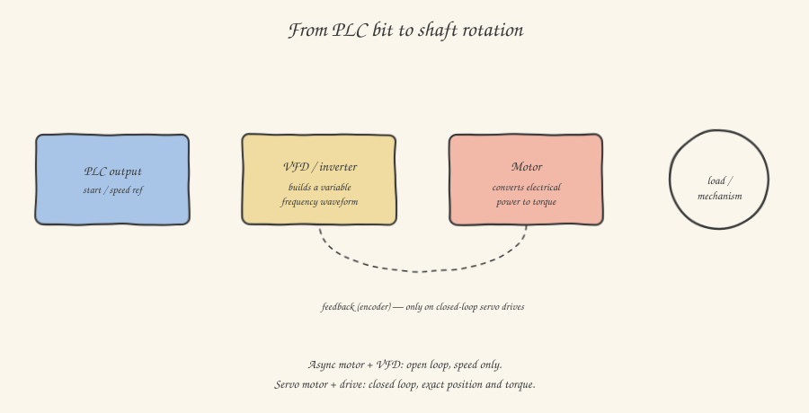

When you read a line like `Q1.2 Motor_Conveyor_Run` in the I/O list, coming from software the temptation is to think of the motor as a boolean actuator, just a bit bigger than an LED: turn it on, it spins; turn it off, it stops. It's an abstraction that works for a simple conveyor belt, and fails miserably as soon as the machine needs to position something precisely, or control the applied torque, or synchronize several axes with each other. In this article we sort out the three types of motor you'll encounter most often, and above all understand what changes, from the point of view of what you actually program.

## The three-phase asynchronous motor: the simple, rugged workhorse

It's by far the most widespread motor in industry, and probably the first one you'll see when you open a panel: three windings fed by a three-phase voltage shifted by 120 degrees, generating a rotating magnetic field in the stator. This field "drags" the rotor along, which spins slightly slower than the field itself (hence the name "asynchronous": the speed difference, called *slip*, is what generates torque). It's a rugged, cheap, practically maintenance-free motor, but in its simplest form it has a real drawback for a controls engineer: **connected directly to the grid, it spins at a fixed speed**, determined by the grid frequency (50Hz in Europe) and the motor's number of poles. It isn't meant to be "positioned" precisely: it's meant to spin, full stop.

This is where the **inverter**, also called a **VFD** (*Variable Frequency Drive*), comes in: a power electronics device that, instead of connecting the motor directly to the grid at a fixed 50Hz, first rectifies the AC current into DC and then reconstructs it into a new AC wave at variable frequency (and therefore speed), generated electronically through fast-switching components (IGBTs). By varying the frequency, the inverter directly varies the motor's rotation speed, and in many applications it also allows fine torque regulation and controlled acceleration/deceleration ramps — a far-from-trivial detail when you need to stop a loaded conveyor without the product on top sliding forward from inertia.

From your software's point of view, an asynchronous motor driven by an inverter almost always talks to the PLC over a fieldbus (we'll dedicate an article to this) with a handful of key parameters: a run/stop command, a speed reference (often expressed as a percentage of maximum speed, or directly in Hz), and a status feedback telling you whether the motor is actually turning, whether there's an alarm, and sometimes the real-time current draw — a valuable value, because an abnormal current is often the first symptom of a mechanical problem (a bearing starting to seize, a belt that's too tight) well before it turns into an outright failure.

## The servomotor: when you need to know exactly where you are

If an asynchronous motor with an inverter gives you control over speed, the **servomotor** gives you control over **position**. That's an important conceptual leap. A servomotor is, almost always, a permanent-magnet synchronous motor paired with an **encoder** (you already met these in the previous article) mounted directly on the shaft, and a dedicated drive that closes a **closed-loop** control system: the drive continuously compares the position requested by the PLC with the one read from the encoder, and corrects the current delivered to the motor in real time to cancel the error. It's the same conceptual principle as a PID controller you've probably already met in other contexts — but here applied physically to a motor shaft, dozens or hundreds of times per second.

This precision control comes at a price, both literally (servomotors and their drives cost much more than an asynchronous motor with an inverter) and in complexity: where an asynchronous motor only needs a run/speed command, a servo axis typically requires a full set of motion parameters — maximum acceleration, deceleration, jerk (the rate of change of acceleration, which if too abrupt generates unwanted mechanical vibration) — and is often driven not with simple bits but with a real positioning protocol (standard technology functions such as those defined by the PLCopen Motion Control profile, which you'll find implemented in practically every modern PLC through functions like `MC_MoveAbsolute` or `MC_MoveVelocity`).

Where do you find servomotors in the field? Wherever accurate, repeatable positioning is needed: cutting axes, Cartesian robots, labeling systems that must apply a label at exactly the same spot on thousands of consecutive parts, lifting rods that must stop at a precise height without oscillation.

## The stepper motor: cheap precision, but (almost) never with feedback

A third family, more common in small positioning tasks and prototyping (you'll also encounter it often in 3D printing, if you've already tinkered with that) but also present in light industrial applications, is the **stepper motor**. The principle differs from both of the previous ones: the rotor advances in discrete "jumps" (steps, precisely) in response to sequential electrical pulses applied to the stator windings. By counting the pulses sent, in theory you know exactly how much the motor has rotated, **with no need for a feedback encoder** — it's open-loop control.

The structural flaw, and the reason you won't find it on critical axes of heavy industrial machines, is that if the motor encounters a load greater than the torque it has available at that instant, it "loses steps": it keeps receiving pulses but the rotor doesn't faithfully follow them, and the system silently loses sync between "how many steps I sent" and "where the shaft actually is" — an error that, without a verification encoder, the control system has no way of noticing until something visibly goes wrong downstream.

## A mental checklist to orient yourself in the field

When you see a motor on a machine, the questions that help you classify it quickly are: does it need to position itself precisely, or just spin at a certain speed? Just speed — almost certainly asynchronous with an inverter. Precise, repeatable positioning with variable loads — almost certainly a servomotor. Simple positioning, light and predictable loads, limited budget — probably a stepper. And in all three cases, the common thread stays the same as always: the PLC never "sees" the motor directly, it always sees an electronic intermediary — inverter or drive — that translates your digital commands into a real electrical waveform on the motor winding.

In the next article we stay in the mechanical world, but change subject: how the motion generated by these motors physically gets where it needs to go, through belts, chains, ball screws, and linear guides.
