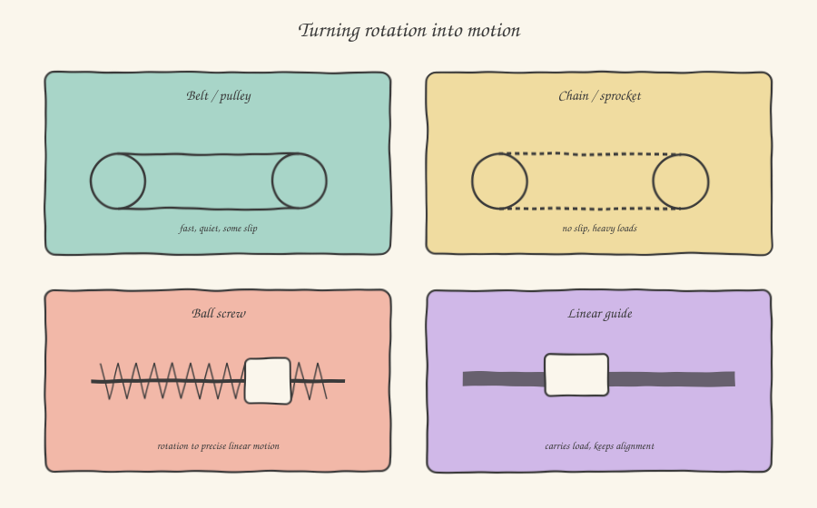

A motor, on its own, can do exactly one thing: turn its own shaft. Everything else — moving a slide in a straight line, lifting a weight, synchronizing two axes that need to move in a fixed ratio to each other — is the job of **transmission components**: the mechanical parts that take that rotation and turn it into something else. This isn't a chapter of applied mechanics in the academic sense: much more pragmatically, it's the reason a machine is built a certain way, and knowing it helps you understand, looking at a real machine, why that motor is mounted there and connected that way to that slide.

## Belts and pulleys: lightness and quietness, with a trade-off

Belt drive is probably the single most common way to transmit motion between two parallel axes at short-to-medium distance: a belt (reinforced rubber, often toothed to avoid slipping) wraps around two pulleys, one connected to the motor and one to the component to be moved. It's light, cheap, quiet, and naturally dampens vibration — a valuable property when the machine runs at high speed.

The trade-off is about precision: even a toothed belt, as stiff as it is compared to a flat one, has a minimal intrinsic elasticity and some backlash in the meshing with the pulley teeth. For a conveyor belt this is irrelevant. For an axis that has to position a tool with an accuracy of tenths of a millimeter, this elasticity translates into a positioning error that an encoder on the motor, by itself, cannot correct — because the encoder measures how much the motor has turned, not how much the load at the other end of the belt has actually moved. This is one of the reasons why, on the most critical precision axes, you'll often find a second encoder mounted directly on the moving part (a configuration called *direct feedback*, or *linear feedback*), which closes the control loop on the load's actual position rather than the motor's presumed one.

## Chains and sprockets: when you need force with no compromises

Where the belt gives way in favor of ruggedness, you find the chain: articulated metal links meshing with toothed wheels (sprockets). Unlike a belt, a chain is practically inextensible and never slips — it transmits motion with a fixed, exact ratio, point for point. It's the typical choice for heavy loads and harsh environments (dirt, high temperatures, oil) where a rubber belt would degrade quickly: lifting chains, chain conveyors for pallets and heavy products, power transmissions on presses and rugged industrial lines.

The price of this ruggedness is maintenance: a chain needs periodic lubrication and, over time, stretches slightly as its joints wear (a phenomenon called *wear elongation*), requiring periodic retensioning — an operation that, if you see it happening in the field during a scheduled machine stop, you now know exactly why it's done.

## The ball screw: the elegant way to turn rotation into precise translation

When you need to turn rotary motion into linear motion — not simply carrying something around in a circle, but moving a slide back and forth along an axis — the most common component in precision applications is the **ball screw**. The principle is, on the face of it, that of an ordinary screw: a nut that advances along a threaded shaft as it rotates. The substantial difference, which justifies the name, is that between the nut and the shaft's thread there's no direct sliding contact, but a series of metal balls that roll inside the thread's channel and are continuously recirculated through a return channel inside the nut.

Why does this detail matter? Because in a traditional screw the contact is **sliding** (sliding friction), with significant friction losses and wear over time; in a ball screw the contact is **rolling** (rolling friction), enormously more efficient — efficiencies over 90%, versus 20-40% for a traditional screw — with minimal mechanical backlash that stays constant over time. This is why practically every precision linear axis in a machine tool, a dosing system, or a high-end packaging machine uses a ball screw paired with a servomotor: the combination of the two components — a closed-loop motor plus an extremely low-backlash transmission — is what makes it possible to position a load with a repeatability of a few micrometers.

A key parameter you'll find in a ball screw datasheet is the **lead** (in millimeters per revolution): it defines how far the nut advances linearly for each full turn of the shaft. With a motor whose rotation you know exactly (thanks to the encoder), and a known lead, calculating the slide's linear position becomes a simple proportion — the formula that, in all likelihood, you'll already find encapsulated inside the axis *scaling* functions in your motion control software.

## Linear guides: the quiet job of keeping everything aligned

One last component, often overlooked because it doesn't "generate" motion but **accompanies** it, are linear guides: pairs of carriages sliding on rails, supporting the load and constraining it to move exactly along the intended direction, with no lateral or vertical deviation. Here too, the most common solution in precision applications uses balls or rollers enclosed in the carriage rolling on the rail, for the same reason as the ball screw: minimal friction, minimal wear, maximum repeatability.

Why does this matter, even though it's not "electrical" and seemingly far from your job? Because a servo axis that vibrates, that doesn't reach the requested position with the expected accuracy, or that draws an abnormal current during motion, sometimes has nothing wrong with the control software or the controller tuning: the problem is a dirty, misaligned, or damaged linear guide, introducing extra friction or a mechanical constraint that the motor has to overcome on top of everything else. Knowing that component exists, and what it does, gives you one more diagnosis to consider before spending hours reviewing PID parameters that were, in fact, already correct.

In the next article we enter a completely different world, one you probably know even less about than the mechanical one: pneumatics, starting with how the compressed air feeding every cylinder on the machine is produced and treated.
