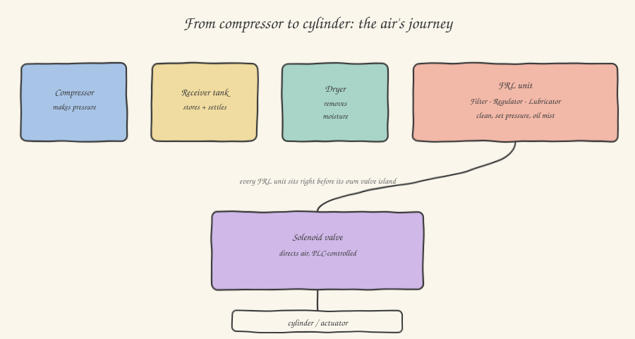

Here we start a small block of three articles dedicated to pneumatics, and if you come from a purely software or electronics background, this is likely the newest territory in the whole series. And yet, as soon as you walk into a production department, the background sound you hear — that intermittent hiss, that rhythmic "sssh-clack" — is almost always pneumatics at work. Before we get to valves and cylinders (we'll see them in the next two articles), we need to answer an upstream question: where does the compressed air feeding all of this physically come from?

## The compressor: the heart of the pneumatic system

Every industrial pneumatic system starts with a **compressor**, almost always just one for the whole plant, feeding a network of piping distributed to all the connected machines — a bit like the electrical system distributes power to every outlet in a house, starting from a single meter. The most common type in industry is the **rotary screw compressor**: two intermeshing helical rotors that, as they turn, progressively trap air in ever-smaller volumes, compressing it continuously — unlike the piston compressor, cheaper but typically reserved for small or portable systems, which compresses air in discontinuous strokes, with more noise and vibration.

The compressor is typically regulated to keep the network at a standard **working pressure** — very often around **6-7 bar** — a value worth memorizing because you'll keep running into it in pneumatic component datasheets as the reference nominal pressure. Worth noting: the "bar" we're referring to here is almost always **gauge** pressure (measured relative to atmospheric pressure, not absolute) — a detail that makes a concrete difference in sizing calculations, but that will rarely cause you problems in day-to-day commissioning work, because all industrial instruments (pressure gauges, pressure sensors) are calibrated to read the gauge value directly.

## The receiver tank: a shock absorber, not just a container

Right after the compressor you'll almost always find a large cylindrical metal tank, the **receiver tank**. Its function isn't as simple as "holding air": it serves to **decouple** the compressor's continuous (or near-continuous) production from the plant's instantaneous consumption spikes. Imagine a dozen machines that, at the same instant, all fire several pneumatic cylinders together: the air flow demand at that instant can far exceed what the compressor can produce in real time. The tank, having built up a reserve during lower-consumption moments, absorbs these spikes, keeping the network pressure stable. It also has a second, less obvious role: acting as a large expansion volume, it lets the air cool down and some of the residual moisture and oil from the compressor condense and settle at the bottom, where it's periodically drained through a purge valve (nowadays often automatic, timer- or level-controlled).

## The dryer: the invisible enemy is moisture

Atmospheric air, the air the compressor draws in to compress, always contains a certain amount of water vapor. When this air is compressed and then cools down along the network, that vapor condenses into liquid water — exactly like the fogging on a cold glass on a humid day. This water, traveling inside the pneumatic piping all the way to valves and cylinders, is a serious problem: it corrodes internal components, washes lubricant off moving parts, and in cold climates can even freeze inside the pipes. That's why, in every serious industrial plant, after the tank you'll find a **dryer** (*air dryer*), almost always of the **refrigerant** type: it deliberately cools the air down to a few degrees above zero, forcing the excess moisture to condense out (which is then drained), before letting it return to ambient temperature, now "dry" to the standard required by the plant.

## The FRL unit: the final treatment, right before each machine

If the compressor, tank and dryer are centralized systems serving the whole plant, the final treatment happens locally instead, often right at the entry of each individual machine, or even each individual group of valves (a *valve island*, which we'll cover in the next article): the **FRL unit**, an acronym for **Filter, Regulator, Lubricator**, three components almost always assembled into a single compact block, instantly recognizable on sight in any pneumatic panel.

**The filter** removes residual solid particles and any remaining traces of condensate that may have slipped past the upstream treatment, protecting the more delicate components (valves in particular, which have very tight mechanical tolerances) from wear and jamming.

**The pressure regulator** is perhaps the most functionally important component: it lets you set, via a knob, the exact working pressure for that specific machine or application, independent of the general network pressure upstream (which can fluctuate). This is where, during commissioning, you adjust the cylinders' operating pressure: too low a pressure and the actuator doesn't have enough force to complete its stroke against the expected load; too high a pressure and you risk over-stressing the mechanics, as well as wasting compressed air (which, never forget, has a real and far from negligible energy cost for the company).

**The lubricator** (increasingly often omitted nowadays, because many modern pneumatic components are designed to run on dry air with no additional lubrication, the so-called *oil-free* components) nebulizes a tiny amount of oil into the passing air, to lubricate the moving internal parts of the downstream cylinders and valves — a detail always worth checking against the manufacturer's manual, because mixing lubricated air and oil-free components in the same circuit can, in some cases, cause more harm than good.

With this clear picture — where the air comes from, how it's treated, and at what pressure it reaches the point of use — in the next article we can finally open up the heart of pneumatic control: solenoid valves, the component that turns a bit from your PLC into real physical motion of air.
