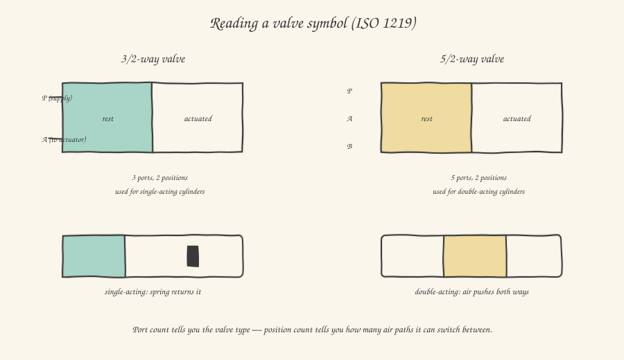

In the previous article we followed compressed air from the compressor all the way to the machine's doorstep, clean, dry and pressure-regulated. Now we get to the component that truly connects your software to the physical world of pneumatics: the **solenoid valve**. It's the exact pneumatic equivalent of the contactor you met when we talked about the electrical panel: a low-power (24VDC) PLC output drives a coil, which in turn acts on a mechanism capable of handling a far greater air flow than an electrical signal alone could ever manage.

## How it works inside: a pin that moves

Put simply, inside a solenoid valve there's a small moving element — a pin or small piston, called a *spool* — that, by shifting a few millimeters inside the valve body, opens or closes several internal channels, connecting or disconnecting the air paths. When the electrical coil is energized, it generates a magnetic field that pulls in a metal core connected to the spool, moving it from the rest position to the working position. When the coil is de-energized, a return element — almost always a mechanical spring, or in some cases the air pressure itself suitably routed (so-called pilot-operated valves) — brings the spool back to the rest position.

This behavior — rest/working — is exactly what the standard valve nomenclature describes, which we can now decode: when you read **"3/2-way valve"** or **"5/2-way valve"**, the first number indicates how many **ports** (physical connection points: supply, use, exhaust) the valve has, the second number indicates how many **positions** the spool can take.

## The 3/2-way valve: the choice for single-acting cylinders

A **3/2-way valve** has three ports — typically labeled **P** (supply, *pressure*), **A** (use, toward the actuator) and **R** (exhaust, *release*, to atmosphere) — and two positions. At rest it connects A to R (the use port is vented, with no pressure); when the coil is energized, it connects P to A (the use port receives pressurized air), closing R at the same time.

This configuration is perfect for driving a **single-acting cylinder**: a cylinder that's fed compressed air on only one side, and returns to its rest position via an internal mechanical spring when the air is removed. The PLC only has to manage a single bit: energize the coil to extend the cylinder, de-energize it to bring it back (by gravity or by the return spring).

## The 5/2-way valve: the most common choice, for double-acting cylinders

Much more widespread in industry is the **5/2-way valve**: five ports (one supply P, two use ports A and B, two separate exhausts, often labeled R and S) and two positions. In one position, it connects P to A and B to exhaust; in the other (reversed) position, it connects P to B and A to exhaust. The practical result: you always have two working lines, one pushing the cylinder one way and one pushing it the other way, **both actively pressurized in turn** — never a spring push, always air.

This is the typical configuration for **double-acting cylinders**, where compressed air pushes the piston in both directions (one chamber for extension, one for retraction), with no need for any internal mechanical spring. The practical advantage is twofold: the return stroke is as actively controlled as the outward one (useful if you need force on the way back too, not just going out), and the cylinder can be mounted in any orientation — horizontal, vertical, upside down — without depending on gravity or a spring to complete the return stroke.

From the PLC wiring point of view, a 5/2-way valve with a **single coil** (where a mechanical spring returns the spool to rest when the coil de-energizes) is driven exactly like a 3/2: a single output bit, one "true" state for extension and "false" for rest. But there's also a very common variant, the **double-coil 5/2** (*bistable*): it has no return spring at all, and the spool holds its position even when both coils are de-energized — a detail with a huge practical impact, which we'll get to in a moment.

## Monostable vs bistable: a choice with real safety consequences

A **monostable** valve (with a single coil and a spring return) has a well-defined rest state: as soon as power is removed — even due to a fault, an emergency, or simply because the PLC goes into stop — the spool always returns to the same predefined position, and with it the cylinder moves to a known, predictable position. This behavior is often deliberately exploited for safety: if a gripper's cylinder must *always* open in an emergency to free an operator, you choose a monostable valve whose spring returns the valve to the "gripper open" state by design, regardless of the software.

A **bistable** valve, on the other hand, holds its last commanded position even with no power — a valuable property when an actuator needs to "stay where it was" during a power interruption (for example, an actuator holding a heavy part clamped shouldn't suddenly release it just because the power went out), but it requires more careful reasoning in the software about the machine's actual state at restart: after a blackout, the PLC cannot automatically assume the position of a bistable actuator — it must verify it with limit sensors (we'll cover these in the next article), not with the memory of its own last command, which in the meantime could be completely stale.

## Valve islands: where you'll find dozens of solenoid valves grouped together

In real industrial practice, you'll rarely find a single isolated solenoid valve: they're almost always grouped into a **valve island** (or *valve manifold*), a compact block sharing a single common air supply (often right downstream of the FRL unit seen in the previous article) and, increasingly in modern machines, a single electrical connection to the PLC via a fieldbus module integrated directly on the island itself — instead of individually wiring every single coil back to the panel with a dedicated cable. This is a preview of a topic we'll cover more thoroughly when we talk about fieldbuses: saving dozens or hundreds of meters of cable, replacing them with a single bus cable, is one of the main drivers behind the decentralization of I/O in modern machines.

In the next article we close the loop on pneumatics by finally reaching the component that actually puts the air into motion: cylinders, single- and double-acting, how they're sized, and how to read a real datasheet.
