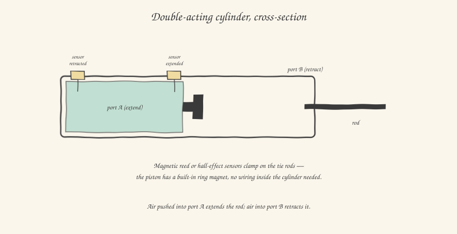

We close out the pneumatics block with the most visible component of all, the one that anyone, even with no technical background whatsoever, would recognize at a glance on a machine: the **pneumatic cylinder**. This is where everything we've built up over the previous two articles — treated and regulated air, the solenoid valve directing its flow — finally turns into a real mechanical push.

## Anatomy of a cylinder: a piston inside a tube

A pneumatic cylinder, in its most common form, is conceptually simple: a cylindrical tube (the *barrel*), closed at both ends by end caps, inside which a piston connected to a rod slides; the rod exits through one of the two end caps and connects mechanically to the load to be moved — a gripper, a slide, a pusher. Compressed air, introduced into one of the two chambers separated by the piston, pushes it, generating force and motion.

We already distinguished, when talking about valves, between **single-acting** cylinders (air on one side, spring return) and **double-acting** ones (air active on both sides). It's worth adding a practical note on when you'd choose one over the other: single-acting is cheaper and simpler to control, and it's the natural choice when you need an automatic, reliable return "by design" even with no signal present — think of a safety clamp that must return to the open position as soon as air or power is lost. Double-acting, much more common overall, is the choice when you need active control in both directions, force on the return stroke too, or when the stroke is long (a single-acting cylinder's spring, beyond a certain length, would become bulky and produce an uneven return force along the whole stroke).

## Limit sensors: how the PLC knows the cylinder has arrived

A pneumatic cylinder, on its own, doesn't tell the PLC where it is: it's an actuator, not a sensor. To know whether a cylinder is fully extended or fully retracted — information almost always essential before advancing the machine's logic sequence to the next step — dedicated sensors are needed, and the standard, elegant, and almost universal industry solution is **magnetic proximity sensors** (often simply called *magnetic limit sensors*, or by the old commercial name *reed switch*, even though the most common technology today is Hall-effect).

The construction trick is this: the piston inside the cylinder carries a permanent magnetic ring, built into its structure. The cylinder barrel, for its part, isn't made of ferromagnetic material but of an alloy (typically anodized aluminum) that lets the magnetic field pass through without shielding it. The magnetic sensors, instead of being mounted inside the cylinder (which would require complex and unreliable internal wiring), are clipped **externally** onto dedicated grooved rails along the barrel, and detect the piston's magnetic field passing by as it transits their position — with no physical contact, no hole in the barrel, no internal wiring. It's the exact same physical principle as the inductive sensor you already met, applied in a specific configuration.

The huge practical advantage of this system is that the sensors are **manually positionable**, sliding them along the barrel's external groove and locking them with a small screw once in the desired position — an operation you'll actually perform during commissioning, when you need to precisely adjust the exact point at which the PLC should consider each individual cylinder's extended or retracted position "reached".

## Sizing: how much force a cylinder really generates

Sizing a machine's cylinders usually isn't your job — that's work done by the manufacturer's technical office, during mechanical design, well before you receive the I/O list. But understanding the basic reasoning helps enormously in "sensing" whether something's off when, in the field, a cylinder seems too slow or unable to complete its stroke against a certain load.

The theoretical force generated by a double-acting cylinder during **extension** is calculated with a very simple formula, the exact same logic as the hydrostatic pressure you've probably seen elsewhere:

**F = P × A**

where **F** is the force (in newtons), **P** is the air pressure (in pascals, or more practically converted from bar), and **A** is the area of the piston surface the air pushes on (in square meters). Conceptually, what does this formula say? That the exact same pressure applied over a larger surface generates a proportionally greater force — which is why, for the same available network pressure (the familiar 6-7 bar seen in the first article of this series), a cylinder with a larger diameter generates greater force, simply because it offers more surface area for the air to push on.

An interesting detail, and often a source of misjudgment for those who've never done this calculation: during **retraction**, the force is slightly lower at the same pressure, because the rod passing through the end cap "steals" a portion of the piston's useful area on that side — the air, in that chamber, pushes on a ring-shaped area, not a full circle. For most applications the difference is negligible, but in manufacturers' catalogs (Festo, SMC, Camozzi are names you'll find everywhere in Europe) you'll always find two separate force values, one for extension and one for retraction, precisely for this reason.

## A concrete datasheet-reading example

Imagine having to check whether an SMC CDQ2-series cylinder, 32mm bore, supplied at the standard network pressure of 6 bar, has enough force to push a load with an estimated resistance of 350N. The datasheet gives you the piston area (for a 32mm bore, about 8 cm², i.e. 0.0008 m²). Applying the formula: F = 600,000 Pa × 0.0008 m² ≈ 480N of theoretical force. That looks sufficient against the required 350N — but here comes one last practical consideration every commissioner learns quickly in the field: the theoretical force calculated this way is the **ideal static** value, without accounting for internal cylinder friction, pressure losses in the piping, and above all with no safety margin at all. The rule of thumb widespread in the field is not to exceed, under real operating conditions, about 70-80% of the calculated theoretical force — in our example, a real operating margin of around 340-380N, already close enough to the required limit that, during commissioning, you'd be well advised to consider a larger-bore cylinder or a higher operating pressure, before the problem shows up in production as a cycle that's too slow or a cylinder that, with wear, stops completing its stroke.

This closes the pneumatics block. In the next article we look, by contrast and for completeness, at pneumatics' big sister for when you need really large forces: hydraulics.
