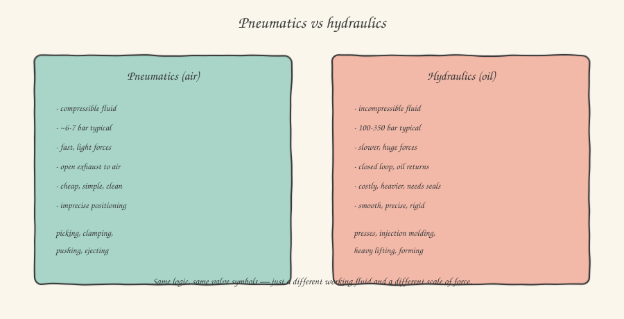

After three articles on pneumatics, hydraulics might at first glance look like a redundant chapter: pumps, valves, cylinders — the same names, the same concepts, almost the same vocabulary. And it's true: the conceptual architecture is remarkably similar. But the choice between the two worlds is never arbitrary, and understanding why a designer picks hydraulics over pneumatics — or vice versa — gives you an extra diagnostic tool when you're standing in front of a machine you've never seen before: by looking at which of the two technologies was used, you immediately understand something about the force and precision requirements that part of the machine had to meet.

## The underlying difference: a fluid that compresses, one that doesn't

The starting physical difference is simple to state but has deep consequences for everything else: air is a gas, **compressible**; hydraulic oil is a liquid, practically **incompressible** under normal operating conditions. This single property explains almost all the practical differences between the two systems.

A pneumatic system, precisely because air compresses, behaves in a slightly "elastic" way: when you apply a load to a stationary pneumatic cylinder, the rod's position can yield by a small amount as the air in the chamber compresses further to balance the new load — a pneumatic cylinder is never perfectly "rigid" under a variable load. A hydraulic system, by contrast, with oil being incompressible, behaves in an almost perfectly rigid way: apply a load to a stationary hydraulic cylinder (with the valves closed) and the position barely gives at all, because there's no fluid volume that can compress to absorb the change. This is why, wherever a firm, rigid position is needed under heavy, variable loads — think of the dies of an injection molding press — hydraulics is almost always the mandatory choice.

## The pressures involved: a different order of magnitude

Remember the typical pneumatic working pressure, around 6-7 bar? An industrial hydraulic system typically works between **100 and 350 bar**, and even higher in some applications. Applying the same F = P × A formula we saw for pneumatic cylinders, you immediately see why: for the same piston area (and therefore the same cylinder footprint), working at a pressure 20-50 times higher generates a force 20-50 times higher. This is why a relatively compact hydraulic cylinder can generate forces on the order of tons, where a pneumatic cylinder of comparable size would top out at a few hundred newtons.

## The hydraulic pump: the heart of the system, always running

Where a pneumatic system draws from a centralized compressed-air network shared by the whole plant, a hydraulic system is almost always **self-contained and local to each individual machine**: a dedicated hydraulic power unit (*power pack*), made up of an oil reservoir, a pump driven by an electric motor, and a bank of control valves, all mounted directly on or next to the machine. The most common pump in industry is the **gear pump** (cheap, rugged, suited to medium pressures) or, for higher-precision applications and higher pressures, the **axial piston pump**, capable of delivering variable flow by adjusting the tilt of an internal swash plate — an elegant mechanical detail that lets you modulate oil flow, and therefore movement speed, without having to throttle the flow with a valve (a solution that would waste energy as heat).

An operational detail never to underestimate during commissioning: unlike pneumatics, where excess air is simply vented to atmosphere (hence the characteristic hiss), a hydraulic system is a **closed circuit**: the oil, after moving the actuator, must return to the reservoir through a dedicated return line. This means every hydraulic valve, unlike a pneumatic one, always needs an explicit return path to the reservoir, and an oil leak is not just a waste (as a small air leak would be) but a real environmental contamination to be handled carefully — one of the reasons predictive maintenance on hydraulic systems (periodic checks of seals, filters, oil level and quality) is much more rigorous than in pneumatics.

## The hydraulic motor: when you need continuous rotation at high force

Besides linear cylinders — conceptually identical to the pneumatic ones seen in the previous article, just sized for much higher pressures and with more robust seals — hydraulics also offers **hydraulic motors**, the rotary equivalent of the cylinder: instead of generating a linear stroke, pressurized oil continuously turns a shaft, generating very high torque even at low speed — a valuable trait in applications like lifting winches or drives for large gears, where an equivalent electric motor would need a much bulkier mechanical reduction to achieve the same torque at low speed.

## How it's controlled from the PLC: same logic, different valves

The good news, for you as the one programming the control software, is that from a logical point of view commanding a hydraulic system from the PLC follows exactly the same conceptual scheme as pneumatics: solenoid valves (here more often called **hydraulic directional control valves**, but with the same ISO 1219 symbols and the same ports/positions naming you already learned) driven by digital PLC outputs, routing fluid flow to one or the other chamber of the actuator. The main difference you'll encounter in practice is that high-end hydraulic applications often use **proportional valves**, driven not by a simple on/off signal but by an analog signal (typically 0-10V or 4-20mA, the same standards seen with analog sensors), which lets you continuously modulate the valve opening and therefore the actuator's speed and force — a level of fine control that's rarer in pneumatics, given the low cost of its components.

## When to choose which

A practical, simplified but useful rule of thumb: if you need speed, a fast cycle, modest force, and cleanliness (no possible oil leaks in a food or pharmaceutical environment) — pneumatics. If you need very high force, rigidity under load, and fine, continuous speed control even under heavy loads — hydraulics. It's not rare, in fact it's the norm, to find both technologies on the same machine: pneumatics for fast, light auxiliary functions (grippers, ejectors), hydraulics for the main component that has to generate the actual working force — think of a press, where the die is moved by a large hydraulic cylinder, but ejecting the finished part is handled by a small pneumatic cylinder.

In the next article we leave power and force behind for a topic that's just as critical but of a different nature: functional safety, and the specific way — very different from how you'd normally think about software — that industry designs it.
