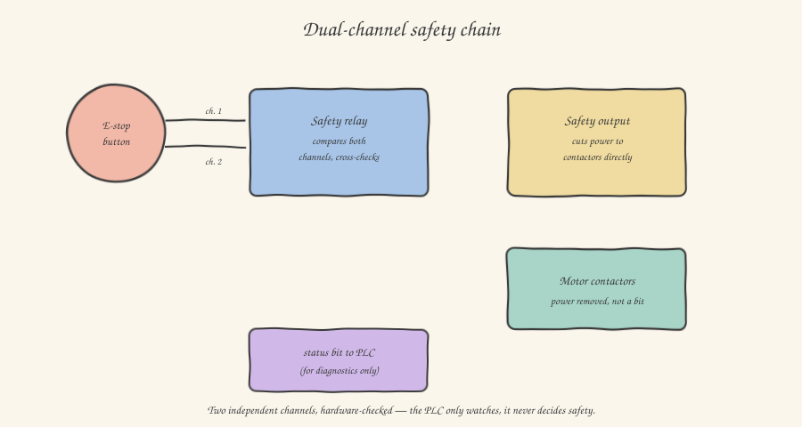

If you come from software, you probably have an implicit idea of how an emergency stop button should work: a digital input, read by the PLC, which if active forces all outputs to zero. Logical, clean, easy to program. And it is, almost always, **wrong** — or rather, insufficient — in the real industrial world. This article explains why, and introduces you to a completely different way of reasoning, one well worth internalizing because it's probably the single most important concept in this whole series from a professional-responsibility point of view.

## The underlying problem: software can always fail

The reasoning behind industrial functional safety starts from an uncomfortable but honest admission: **any system, including your PLC software, can fail**. A bug, a scan-cycle lockup, an output module that stays electrically stuck in an active state due to an internal hardware fault (a real phenomenon, called a *stuck-at fault*), a short circuit that keeps a coil energized even after the PLC has correctly commanded it off: these are all low-probability but non-zero scenarios, and in a context where an error can cause a serious or fatal injury, "low probability" is not an acceptable level of risk.

The practical consequence of this admission is a principle you'll find everywhere in machine design: **safety functions must not depend on the correct operation of the standard PLC**. Not because the PLC is unreliable in an absolute sense (industrial PLCs are extremely reliable), but because a safety function has to remain effective even under the assumption, however remote, that something in the standard control system goes wrong.

## How it's actually built: the dual-channel safety circuit

The real emergency stop button, the red mushroom-head one you find on every machine, isn't wired to a normal PLC digital input. It's wired to a dedicated device, the **safety relay**, through a **dual-channel** circuit: the button has, inside it, not one contact but two electrically independent contacts, wired along two separate paths all the way to the safety relay. The relay continuously reads both channels and compares them: if they're consistent (both closed, machine normal; both open, emergency pressed) everything proceeds normally; if the two channels turn out to be **inconsistent** — one open and the other still closed — the relay interprets this as a possible fault in the wiring itself (a cut wire, a damaged contact) and forces the safe state regardless, even if no one has actually pressed the button. This continuous self-diagnostic mechanism is what makes the system *fail-safe*: any plausible fault in the circuit always and only leads to the safer state, never to an ambiguous state, and certainly never to a state that looks safe but actually isn't.

Notice a crucial detail in the diagram: the safety relay's output **cuts power directly** to the motors' power contactors — it doesn't send a bit to the PLC that would then, in turn, have to decide to shut the motors down. The PLC does receive a status signal from the safety circuit, but **for diagnostic purposes only**: to know the emergency is active and perhaps show it on an operator panel, not to decide whether to actually remove power. Real safety happens at the electrical, hardware level, before and independently of any software logic.

## Safety light curtains: a special case, not an ordinary photoelectric sensor

You already met through-beam photoelectric sensors in the article on sensing. **Safety light curtains** look, at first glance, very similar: a row of aligned infrared transmitters and receivers, detecting the interruption of the beam when something — typically an operator's arm or body — crosses a hazardous zone. But they're profoundly different components from a standard photoelectric sensor: internally redundant, with self-diagnosing electronics, certified to specific functional-safety standards, and also wired to the safety module using the same dual-channel logic — never to an ordinary PLC digital input. Seeing them used in production, typically in front of a robotic cell or an area with dangerous moving mechanical parts, is one of the most immediate examples of applied functional safety: the operator approaching interrupts the beam, and the machine stops through a direct electrical path, not through a loop of software logic that could, in theory, never get executed.

## Categories and Performance Level: a vocabulary you'll need to get familiar with

In machine technical documentation — and in the CE marking every machine placed on the European market must carry — you'll find references to **safety categories** (per EN 954-1, now superseded but still cited) or, in more modern terms, a **Performance Level** (PL, per EN ISO 13849-1), expressed with a letter from **a** to **e**, where **e** represents the highest level of reliability. Without going into the detail of the calculation (which requires component reliability statistics, mean time between failures, diagnostic coverage — specialist work done by the manufacturer's safety engineering office), the concept you need to take away is simple: **the greater the risk associated with a possible failure of the safety function, the stricter the redundancy and self-diagnosis requirements** — and this translates directly into concrete wiring choices you'll see in the field: a low PL can get by with a single channel and a simple safety relay; a high PL, typical of functions protecting against serious hazards (a high-speed robot, a press capable of generating tons of force), typically requires dual-channel with cross-diagnostics, like what we just saw.

## What all this concretely means for your work

When you receive a machine's I/O list, always mentally distinguish between "standard" I/O (the ones you freely program in your application logic) and safety I/O, which in the list are almost always flagged with an explicit label (`SAFETY`, `SIL`, or similar) and which, as a general rule, **you must never handle as if they were an ordinary boolean input in your application program**: your job, at most, is to read their status for diagnostics or to correctly manage restarting the sequence after an emergency reset — never to re-implement in software a safety logic that already is, and must remain, the responsibility of dedicated hardware. It's a distinction that, once internalized, will save you from one of the most serious conceptual mistakes (and potentially one of the most serious in terms of legal and professional liability) a beginner engineer can make in this field.

In the next article we return to more familiar ground — digital communications — to understand why almost no modern machine wires every single sensor all the way to the central panel anymore, and what changes with fieldbuses.
