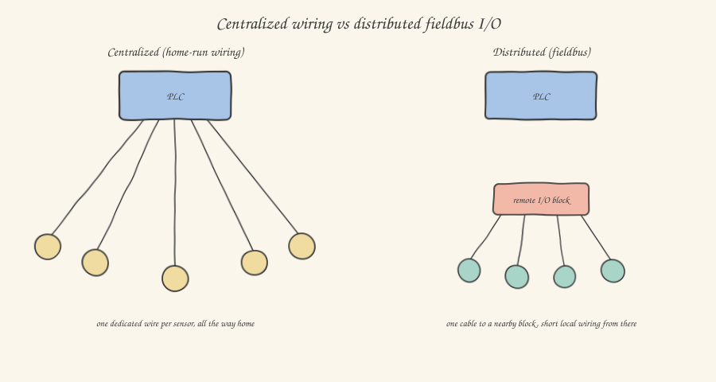

Imagine a medium-sized machine with two hundred sensors and actuators spread across a ten-meter structure. If every single signal had to be wired individually all the way back to the PLC in the central panel — one dedicated wire per sensor, there and back — we're talking about hundreds of cables, some as long as ten or fifteen meters, each with its own cable-tray route, its own ID number, its own dedicated terminal. That's an architecture which, until a few decades ago, was simply the norm — and which today, if you still come across it, you immediately recognize as "old-style". The modern, almost universal solution is the **fieldbus**.

## The underlying idea: one cable, many devices

A fieldbus is, conceptually, a digital communication network dedicated to industrial automation: instead of connecting every sensor and every actuator with a dedicated cable back to the PLC, you connect groups of physically nearby devices to a **remote I/O** (or *distributed I/O*) module, placed directly on the machine, close to the devices it serves. This remote module then communicates with the central PLC over a **single bus cable**, over which the states of all the sensors and the commands for all the actuators connected to that module travel digitally, in rapid sequence.

The wiring savings are enormous, but that's not the only advantage. A remote I/O module typically also offers much richer diagnostic functions than a simple wired contact: you can know not just whether a sensor is active or not, but also whether its cable has been cut, whether it's drawing an abnormal current, whether an output channel is short-circuited — information that, with traditional point-to-point wiring, would require dedicated and costly diagnostic circuitry for every single signal, while on a fieldbus it comes "for free", built into the communication protocol itself.

## The protocols you'll encounter most: Profinet and EtherCAT

The world of fieldbuses has historically been quite fragmented (Profibus, DeviceNet, CANopen, and many others, each with its own industrial backers), but in recent years it has consolidated heavily around solutions based on **industrial Ethernet**, which use the same physical hardware as the Ethernet network you already know from the IT world, with protocols and timing specifically designed to guarantee the determinism that real-time machine control requires (a property that standard "office" Ethernet doesn't guarantee on its own).

**Profinet**, developed by the consortium linked to Siemens, is probably the most widespread in Europe for general industrial use: it uses standard Ethernet packets with extensions to guarantee predictable cycle times, and is relatively simple to configure and diagnose, even with generic network tools.

**EtherCAT**, developed by Beckhoff, takes a technically more refined approach: instead of every device receiving and responding to a separate Ethernet packet (with the inevitable processing overhead for each one), a single Ethernet packet passes in sequence through all the devices connected on the bus, and each one "reads on the fly" the data meant for it and "writes on the fly" its own data into that same packet as it physically passes through, with almost no added delay — a mechanism that lets it achieve extremely low cycle times (fractions of a millisecond for hundreds of devices), which is why you'll often find it in the most demanding motion control applications, where multiple servo axes need to be synchronized with very tight timing precision.

You don't need, for your day-to-day work, to know the deep implementation details of these protocols — that's the domain of the developers of the hardware modules themselves. What you need is to recognize them when you see them in a diagram or in a PLC's hardware configuration, and to know that behind the acronym is exactly the mechanism we just described: one cable, many devices, cyclic and deterministic digital communication.

## What concretely changes in your programming work

From your application code's point of view, the good news is that the abstraction stays almost identical to before: in the PLC configuration software (the *engineering tool*, whether TIA Portal, CODESYS, or others), you configure the remote modules connected on the bus exactly as you'd configure local I/O modules in the PLC rack, and in your program you keep reading and writing boolean or analog variables through the exact same mechanisms — the bus abstraction is, almost always, completely transparent to the application logic. What does change, and is worth knowing for field commissioning, is **network diagnostics**: if a remote module loses communication (a damaged bus cable, electromagnetic interference, missing power to the remote module), all the signals passing through that module become unavailable at the same time, and the PLC typically flags a specific communication error, distinct from a simple sensor failure — an error that, the first time you see it, you'll immediately understand to be of a completely different nature from an application-logic problem, precisely because you now know what's physically behind that communication.

## One last observation: safety has its own bus too

It's worth closing this article by tying it back to the previous one on functional safety: safety circuits, which used to almost always be wired traditionally with dedicated relays, today increasingly travel over *safety* variants of the same fieldbuses (**Profisafe** over Profinet, **FSoE** — *Fail Safe over EtherCAT* — over EtherCAT), which add extra control mechanisms on top of the standard protocol (redundancy codes, sequence numbers, tight timeouts) capable of guaranteeing that a communication fault on the bus never goes unnoticed, thereby preserving, even in a shared network architecture, the same intrinsic safety guarantee as the dedicated wiring you saw in the previous article — a nice example of how a sound engineering principle (redundancy and self-diagnosis) adapts to different technologies without losing its substance.

And so we arrive at the last article in the series: we'll put everything we've seen together — mechanics, electrical panel, sensors, motors, pneumatics, hydraulics, safety, fieldbuses — by dissecting a real machine together, from start to finish.
