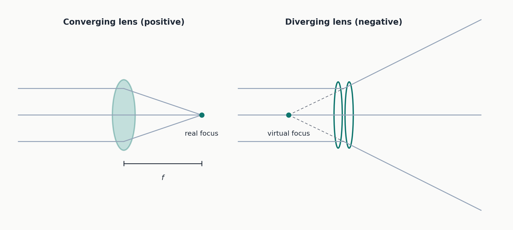
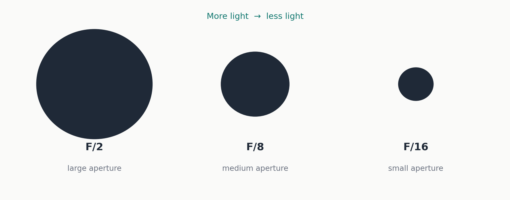
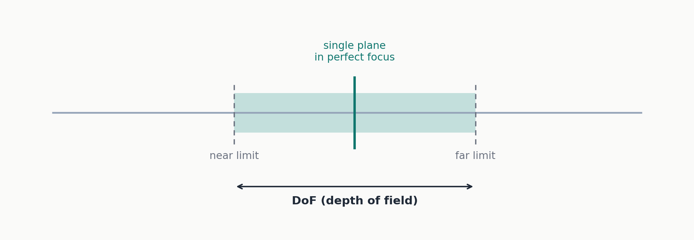

## What an industrial optical system actually does

A lens has one job: collect the light bouncing off an object and rebuild an image of that object on a sensor — usually a CCD or a CMOS, the two technologies behind every digital camera sensor. Your own eye does the same thing: the cornea and the lens bend incoming light onto the retina, and that bending is what lets you reconstruct an image. An industrial camera does exactly the same, with a lens instead of a cornea and a sensor instead of a retina.

In a lab or a hobby project, "good enough" framing is fine. In an industrial inspection system it is not. If you are checking whether a mechanical part is within tolerance, or whether a label printed correctly, you need to know exactly how large the object will appear on the sensor, how sharp it needs to be, and exactly where in space it has to sit for the system to work at all. That is why a handful of parameters, taken together, fully describe how an optical system behaves.

## The parameters that define an optical system

- **Field of view (FoV)** — the total area the lens frames. If you need to inspect a 5 cm object, your FoV has to be at least 5 cm.
- **Working distance (WD)** — the distance between the object and the lens at which the object is in perfect focus. It is not an arbitrary distance: it is fixed by the lens and how it is configured.
- **Depth of field (DoF)** — the range, in front of and behind the perfect focus plane, over which the object still looks "acceptably" sharp. This is one of the parameters that matters most in practice.
- **Sensor size** — the physical size of the sensor, in millimeters, obtained by multiplying pixel size (typically a few micrometers) by the number of pixels.
- **Magnification** — the ratio between the image size on the sensor and the size of the object in the real world. Below 1, the sensor sees less detail than the real scene; above 1, it is effectively zooming into a detail.
- **Resolution** — the smallest distance between two points that the system can still tell apart as two separate points, rather than one blurred spot. It depends on both the lens and the sensor together, not on either one alone.

None of these six parameters is independent. They are linked by precise relationships, and changing one changes the others automatically: move the object closer to the lens, and the field of view shrinks, magnification goes up, and depth of field goes down. Designing an optical system means knowing these relationships well enough to trade them off deliberately, not by trial and error.

## The thin lens equation

To make the math tractable, basic optics relies on two simplifications:

- **Paraxial approximation** — only rays entering the lens at a small angle to the optical axis (the imaginary line through the center of the system) are considered. Rays hitting the edges at steep angles are ignored, which keeps the geometry linear.
- **Thin lens approximation** — the physical thickness of the lens is treated as negligible, so the lens is modeled as a single plane rather than a solid object.

With these two simplifications, you get the equation that everything else in this article builds on:

```
1/s' - 1/s = 1/f
```

where `s` is the object's position relative to the lens (negative by convention, since the object sits "before" the lens along the direction of light travel), `s'` is the image position (positive), and `f` is the focal length of the lens.

Two more terms worth keeping straight, because they show up constantly on lens datasheets: **working distance** is the distance between the object and the front of the lens, while **back focal distance** is the distance between the rear of the lens and the sensor. They live on opposite sides of the lens — do not confuse them.

## Focal length

Rays entering a lens converge toward a single point after being bent by the glass. The distance between the lens and that point is the focal length. In a converging (positive) lens, the rays actually meet at a real focus. In a diverging (negative) lens, the rays spread apart after the lens, so there is no real focus — only a virtual one, the point the rays appear to come from if you trace them backward.



Every lens used in machine vision is, overall, a positive (converging) system: light always has to converge on the sensor plane, or no image forms at all. A lens can contain both positive and negative elements internally to correct optical aberrations, but the assembly as a whole is always converging.

Focal length and field of view move in opposite directions: the longer the focal length, the narrower the field of view. That is exactly what happens when you zoom in on a camera — longer focal length, less of the scene in frame.

One exception matters: when the object sits closer than roughly 10 times the focal length, the standard thin-lens equations stop being accurate. This is called **macro mode**, and it requires lenses specifically designed for close-range work.

## Magnification and field of view

Formally, magnification is:

```
M = h' / h
```

where `h'` is the image size on the sensor and `h` is the real object size. A 10 mm object producing a 5 mm image on the sensor gives M = 0.5.

A related formula ties working distance directly to focal length and magnification:

```
s = f(M - 1) / M
```

Given a lens's focal length and the magnification you need, this tells you exactly where to place the object — the calculation you do when sizing up a quality-control station: you know the part size, you know your sensor size, you compute the magnification you need, and from there you get the required working distance.

There is also a naming convention worth knowing, because it tells you at a glance what a lens is designed for:

- **Macro and telecentric lenses** are designed to work at distances comparable to their own focal length ("finite conjugates"), and are classified and sold by magnification — "0.5X", "1X", "2X".
- **Fixed focal length lenses** are designed for much larger working distances than their focal length ("infinite conjugates" — think of parallel sunlight rays), and are classified and sold by focal length — "8mm", "25mm", "50mm".

If a lens is listed as "2X" rather than "50mm", you already know it belongs to the first family: built to work up close, on small details. A "25mm" lens belongs to the second family: built to work at a distance, like an ordinary photographic lens.

## Mounts and flange focal distance

Before going further into the optics, there is a mechanical question that matters just as much: how does a lens physically attach to a camera? The distance between the mounting flange and the sensor — the **flange focal distance** — is part of every optical calculation above. Get it wrong, and the thin lens equation stops matching reality: the image will not land in focus where it should.

| Mount | Flange focal distance | Notes |
|---|---|---|
| C-mount | 17.526 mm | The most common mount in industrial cameras. 1-inch diameter, 32 threads per inch. |
| CS-mount | 12.526 mm | 5 mm shorter than C-mount. A C-mount lens on a CS-mount camera (or the reverse) puts the sensor at the wrong distance and the image will not be in focus. |
| F-mount | Bayonet (insert and twist) | Developed by Nikon, used for larger sensors. Unlike the others, back focal distance is not adjustable on this mount. |
| Mxx-mount (e.g. M42, M72) | Variable | A family of threaded mounts defined by diameter, thread pitch and flange focal distance — used for sensors even larger than F-mount. |

When choosing a lens for a specific camera, the first mechanical question is always "what mount does my camera use?" — get the mount wrong and you either cannot physically attach the lens, or you attach it at the wrong distance and nothing downstream matters.

Even within a correctly matched mount, real cameras rarely hit the nominal flange focal distance exactly — the protective glass covering the sensor has its own thickness, and light traveling through it shifts the effective focus point slightly. This is why lens manufacturers sell **shim kits**: thin spacers used, especially with telecentric lenses, to fine-tune the real distance to its optimal value. It is not a minor detail — on a telecentric lens, an error of a few tenths of a millimeter in back focal distance can noticeably change the measured magnification, which matters a great deal if the lens is being used for dimensional measurement rather than just "seeing" the part.

## Sensor formats

Two reference tables come up constantly when specifying a vision system: one for **line scan** sensors (which capture the image one row of pixels at a time — typical of production lines where the object moves under the camera), and one for **area scan** sensors (the more common kind, capturing a full image at once, like an ordinary camera).

**Line scan sensors (single-row pixel length)**

| Resolution × pixel size | Sensor length |
|---|---|
| 2048 px × 10 µm | 20.5 mm |
| 2048 px × 14 µm | 28.6 mm |
| 4096 px × 7 µm | 28.6 mm |
| 4096 px × 10 µm | 41 mm |
| 6144 px × 7 µm | 43 mm |
| 8192 px × 7 µm | 57.3 mm |
| 12288 px × 5 µm | 62 mm |

**Area scan sensors (standard formats)**

| Format | Width | Height | Diagonal |
|---|---|---|---|
| 1/3″ | 4.8 mm | 3.6 mm | 6.000 mm |
| 1/2.5″ | 5.76 mm | 4.29 mm | 7.182 mm |
| 1/2″ | 6.4 mm | 4.8 mm | 8.000 mm |
| 1/1.8″ | 7.176 mm | 5.319 mm | 8.933 mm |
| 2/3″ | 8.8 mm | 6.6 mm | 11.000 mm |
| 1″ | 12.8 mm | 9.6 mm | 16.000 mm |
| 4/3″ | 18.8 mm | 13.5 mm | 22.500 mm |
| Full frame 35 mm | 36.0 mm | 24.0 mm | 43.300 mm |

Worth flagging, because it trips up almost everyone starting out: these "inch" labels are historical, not physical. A "1/3 inch" sensor has a 6 mm diagonal, not 8.47 mm as a literal one-third-inch calculation would suggest. The naming dates back to 1950s vacuum-tube cameras, where the *outer diameter of the glass tube* was, roughly, one inch — while the usable light-sensitive area was much smaller than the tube itself. When solid-state CCD sensors arrived in the 1980s and 90s, manufacturers kept the "inch" naming for commercial compatibility, even though it no longer maps directly to any physical dimension. Never derive a sensor's real size from its inch label by direct calculation — always check the millimeter values in the datasheet.

It is also worth knowing that two cameras with the same nominal "format" can still have meaningfully different sensors, because the width-to-height ratio can vary between models. When picking a lens for a specific camera, check the actual sensor dimensions in millimeters — never rely on the nominal format alone.

## Aperture (F-number) and depth of field

This is the densest part of the topic, and also the most practical: how "open" or "closed" a lens is, and what that changes.

### The F-number

A lens's aperture — how large the "hole" is that light passes through, exactly like the pupil of your eye dilating or contracting — is expressed as the F-number, defined under standard conditions as:

```
F/# = f / d
```

where `d` is the aperture diameter and `f` is the focal length. This is counter-intuitive at first: a **higher** F-number means a **smaller** aperture, because `d` sits in the denominator. F/16 is a much smaller opening than F/2.

Standard values found on every lens are F/1.0, F/1.4, F/2, F/2.8, F/4, F/5.6, F/8, F/11, F/16, F/22. Each step up (smaller aperture) **halves** the amount of light entering the lens.



For macro or telecentric lenses (the finite-conjugate family described above), a corrected variant is used, the **working F-number**:

```
wF/# = (1 + M) × F/#
```

The correction accounts for the fact that, when the object is close (as it is with these lenses), magnification itself changes how "closed" the aperture effectively behaves.

### Depth of field

Depth of field can now be defined precisely: it is the range between the nearest and farthest point at which an object still looks acceptably in focus.

There is a subtlety worth sitting with: physically, there is exactly one plane in object space that is perfectly conjugated to the sensor plane — one single plane that produces a mathematically perfect image. Everything else called "depth of field" is really a question of *acceptability*, not perfection: how much blur counts as "still acceptable" depends entirely on the application. A precision dimensional check (measuring a part to within a hundredth of a millimeter) demands far more sharpness than a generic visual inspection (just checking a label is present and legible).



A practical formula for estimating depth of field:

```
DoF [mm] = wF/# × p[µm] × k / M²
```

where `p` is the sensor's pixel size in micrometers, `M` is the lens magnification, and `k` is a dimensionless, application-dependent factor — typically **0.008** for dimensional-measurement applications (where sharpness matters most) and **0.015** for defect-inspection applications (where somewhat more tolerance is acceptable).

**Worked example.** Lens magnification M = 0.25X, working F-number wF/# = 8, sensor pixel size p = 5.5 µm, defect-inspection application so k = 0.015.

1. M² = 0.25 × 0.25 = 0.0625
2. numerator: wF/# × p × k = 8 × 5.5 × 0.015 = 0.66
3. DoF = 0.66 / 0.0625 = 10.56 mm ≈ **10.5 mm**

A quick honesty note on units: the pixel size in that formula is in micrometers, while the result is stated directly in millimeters — a jump of three orders of magnitude that the formula does not spell out explicitly. In practice, the constant `k` almost certainly folds in a dimensional conversion factor along with an empirical criterion for acceptable blur, calibrated from real-world testing rather than derived from first principles. That does not make the formula wrong — the numbers check out — but it is worth knowing it is an engineering shortcut, not a first-principles derivation, so you do not try to re-derive it from scratch and assume you made an error when your own math does not reproduce it cleanly.

On which F-number to pick: F/8 is a common sweet spot. Smaller apertures (higher F-numbers, like F/16 or F/22) start to suffer from **diffraction** — a wave-optics effect where light spreads out as the opening gets very small, which paradoxically hurts sharpness even as depth of field keeps increasing. Larger apertures (lower F-numbers, like F/1.4 or F/2) are more prone to **optical aberrations and distortion**, imperfections inherent to any lens design that become more visible when using the full aperture.

The underlying trade-off is worth internalizing: small aperture (high F-number) needs more light but gives more depth of field and fewer aberrations; large aperture (low F-number) needs less light but gives less depth of field and more aberrations/distortion. There is no universally "correct" aperture — F/8 is a reasonable default, but the right choice always depends on how much light you actually have and how much depth of field the application needs relative to peak sharpness.

## Four more terms worth knowing

A handful of concepts get mentioned constantly around industrial optics without always being explained in full:

- **MTF (Modulation Transfer Function)** — the standard way to objectively measure how "sharp" a lens is, across different levels of detail. Instead of saying a lens is "sharp" in general terms, MTF tells you numerically how well the system reproduces contrast between increasingly fine lines — it is the tool manufacturers actually use to compare lens quality rigorously.
- **Telecentricity** — a normal ("entocentric") lens makes objects look smaller as they move farther away, exactly like human perspective vision. A **telecentric** lens is specifically designed to remove this effect within a certain distance range: an object measures the same size in the image regardless of exactly where it sits within the depth of field. That is why telecentric lenses are the standard choice for precision dimensional measurement, where a small positioning error must not translate into a measurement error.
- **Pericentric optics** — a less common third family, designed to image the internal surfaces of a hollow object (the inside of a tube, for example) from a slightly angled rather than a straight-on view.
- **Distortion** — a geometric deformation of the image relative to reality: straight lines in the real scene appear curved in the image (barrel distortion curving outward, pincushion distortion curving inward). It is a defect that matters for measurement applications and, when necessary, gets corrected in software, because it directly affects the accuracy of any dimensional measurement taken from the image.

## How it all fits together

1. **Focal length (f)**, together with object distance, determines where the image forms (the thin lens equation) and how large the **field of view (FoV)** is.
2. The ratio between image size and real object size defines **magnification (M)**, which in turn sets the **working distance (WD)** a given lens needs.
3. **Aperture diameter**, relative to focal length, gives the **F-number** — which controls both how much light enters and, together with magnification and pixel size, how large the **depth of field (DoF)** is.
4. All of this has to reconcile with the mechanics: the **mount** and the correct **back focal distance** determine whether the plane where the image "should" form actually coincides with the physical sensor plane.
5. Finally, how well all of this translates into a genuinely useful image also depends on **resolution, MTF, telecentricity and distortion** — factors that go beyond the basic parameters but matter just as much in a real system.

Two threads are worth following further if you only pick two: telecentricity and MTF. They are the concepts most often mentioned only in passing, yet they are central to any real industrial application involving measurement or quality control — understanding them well is what makes a lens datasheet actually legible.
