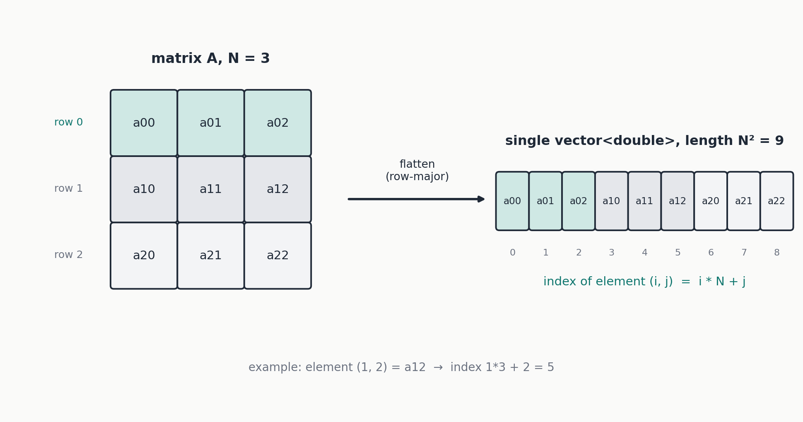
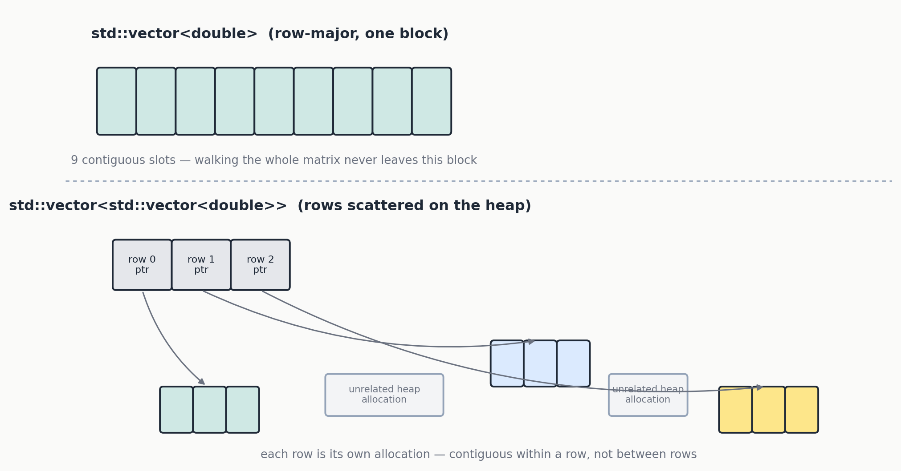
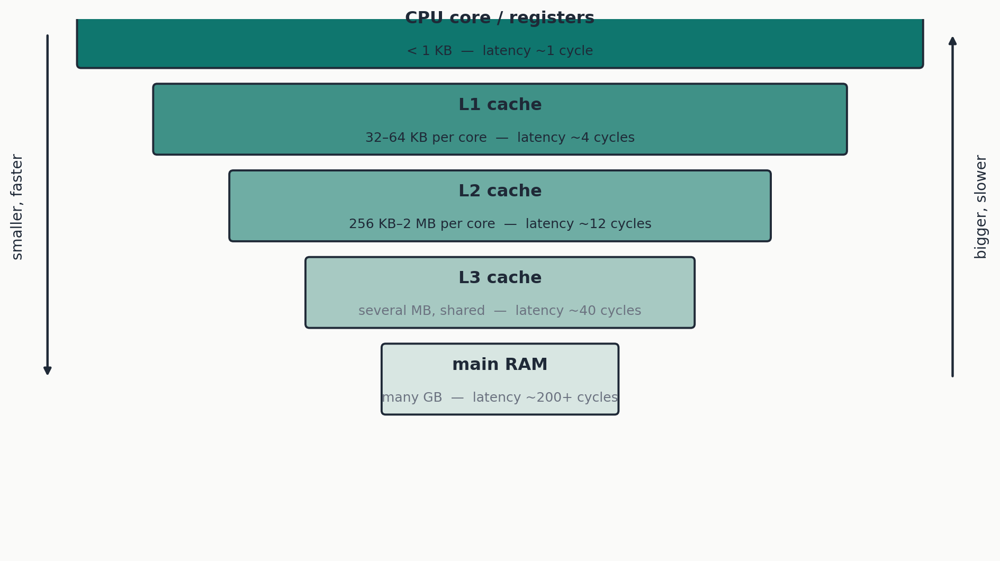
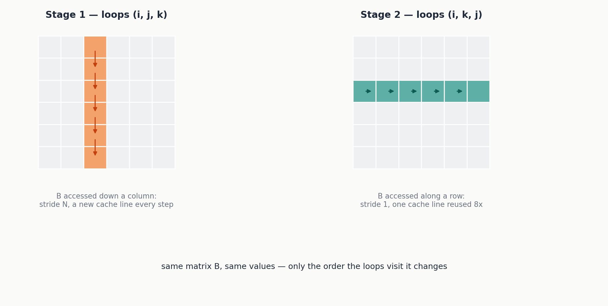
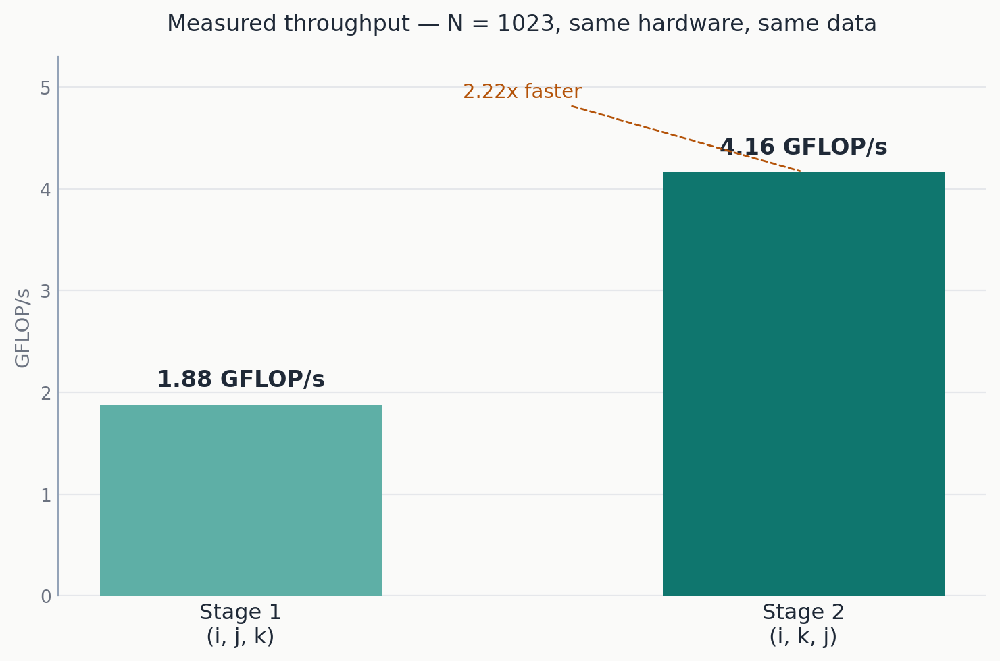

I have been going through MIT's *Performance Engineering* material on my own, and at some point the theory stopped being enough. Reading about cache hierarchies and loop order is one thing; watching your own code go from just under 2 GFLOP/s to over 11 GFLOP/s on your own machine, on the exact same algorithm, is another. So I picked one problem — square matrix multiplication in C++ — and decided to walk through every optimization step myself, measuring honestly at each stage, instead of taking anyone's word for what "should" be faster.

This is the first article in that series. It covers the first part of the journey: why matrix multiplication is slow in the first place, how a modern processor actually fetches data, and the first real optimization — which does not touch the algorithm at all, does not add a single thread, and does not use any special compiler flag. It just changes the order of three `for` loops. The result is a measured 2.22x speedup, and understanding *why* that works is the foundation for everything that comes after it in this series.

You can check all the source code to this [link](https://github.com/kineticCode-dev/MatrixMultiplicationOptimization)

## A problem that is easy to state and expensive to compute

Multiplying two square matrices $A$ and $B$, both of side $N$, produces a third matrix $C$ where every element $C_{ij}$ is the sum of the products between row $i$ of $A$ and column $j$ of $B$:

$$
C_{ij} = \sum_{k=0}^{N-1} A_{ik} \cdot B_{kj}
$$

The definition fits on one line. The cost does not scale nearly as kindly: computing every element of $C$ needs $N$ multiplications and $N$ additions, and there are $N^2$ elements to compute, so the total is on the order of $2N^3$ floating-point operations. Double the side of the matrix, and the work does not double — it gets multiplied by eight. That cubic growth is exactly what makes matrix multiplication such an effective playground for performance work: a speedup that looks negligible on a small, toy-sized problem turns into minutes or hours saved on a large one — a neural network layer, a physics simulation, a state-space control system.

It is also not an academic toy chosen for convenience. Matrix multiplication is, quite literally, the computational core of training and running modern neural networks, of a large share of scientific computing, of 3D graphics, and of many control and estimation algorithms used in automation. The libraries that implement it at the extreme (BLAS, cuBLAS, MKL) are some of the most heavily optimized software ever written — understanding *why* they need to exist, and what they do differently from a naive implementation, is the most direct way into performance engineering in general, not just for matrices.

## How a matrix actually lives in memory

Before talking about speed, one implementation detail has to be nailed down precisely, because everything else in this series depends on it: how an N×N matrix is actually laid out in memory. A computer has no native notion of a "2D grid" — memory is, physically, one long linear sequence of bytes. A two-dimensional matrix has to be *flattened* onto that sequence, and there are exactly two reasonable ways to do it: **row-major**, where entire rows are placed one after another, or **column-major**, the opposite, where entire columns are placed one after another. C and C++ use row-major for native multidimensional arrays; Fortran, and by extension a lot of historical numerical software, uses column-major. This is not a fine implementation footnote — the choice determines, quite literally, which loop order will be fast and which will be slow, as the rest of this article demonstrates.

In the code for this series, an N×N matrix is represented as a single `std::vector<double>` of length $N^2$, in row-major order: the logical element $(i, j)$ lives at index `i * N + j`.



**Why not `std::vector<std::vector<double>>`?** It is tempting — a vector of vectors reads naturally as "a matrix". The problem is that every inner vector is its own, separate heap allocation. Rows end up scattered across memory, with no guarantee of being anywhere near each other; only the elements *within* one row are guaranteed to be contiguous. A single flat vector, indexed by hand, is the only way to guarantee that the whole matrix is one contiguous block — and as the next section explains, contiguity is not a nice-to-have, it is the entire game.



## The processor is not "a calculator that executes instructions" — it is a memory hierarchy

This is the central idea of the whole article, so it is worth sitting with. The intuitive way to picture a processor — it reads an instruction, fetches the data it needs, processes it — is technically correct but hides an enormous detail: **fetching a piece of data does not have a fixed cost**. A modern CPU does not read data directly from main RAM on every access; RAM is far too slow relative to how fast the CPU could, in principle, process data. If every single read had to wait on RAM, the CPU would spend the overwhelming majority of its time simply idle, waiting.

That is why **cache** exists: a series of progressively smaller, progressively closer (physically, on the chip) memories, and therefore progressively faster. A typical modern processor has three levels: **L1**, tiny (32–64 KB per core) but almost as fast as the CPU's own registers; **L2**, larger and still very fast (256 KB – 2 MB per core); **L3**, shared across all cores on the chip, much larger (several MB, sometimes dozens) but the slowest of the three. Only if a piece of data is not found in any of these three levels does the processor have to go ask main RAM for it — an operation that, measured in clock cycles, is drastically slower than an L1 hit.



The cache does not work by copying individual bytes or individual numbers — it copies entire **cache lines**, typically 64 bytes at a time (eight `double` values). This works because of a bet, called the **principle of locality**, that turns out to win the overwhelming majority of the time in real programs: if you just used the data at address X, you are very likely to use the data at nearby addresses soon too (*spatial* locality), and you are likely to reuse the data at address X itself again shortly (*temporal* locality). A program that honors this bet — that walks memory sequentially and reuses what it just loaded — runs fast. A program that betrays it — that jumps around memory, touching each piece of data once and never again — pays the full price of a RAM access, repeatedly, even though from the algorithm's point of view it is doing "the same amount of work."

## Where this actually bites in matrix multiplication

Back to the formula: $C_{ij} = \sum_k A_{ik} \cdot B_{kj}$. The "textbook" way to write this in code uses three nested loops over the indices i, j, k, in that order — because that is the order in which the mathematical formula naturally reads from left to right. The problem is that, with row-major memory, the access `A[i * N + k]` moves sequentially as k varies (perfect spatial locality), while the access `B[k * N + j]`, with k as the *innermost* index, jumps by an entire row — N elements — on every single iteration. That is the exact opposite of spatial locality, and on the worst possible side of it: for N large enough, each jump of N elements lands outside L1 cache, and often outside L2 as well, forcing a slow access on every single multiplication.

This is precisely the kind of observation this series is built to make tangible rather than purely theoretical. The rest of this article writes the "textbook" version, measures it honestly, and then transforms it — without changing a single numeric result it produces — simply by changing the order of the three loops. The improvement will not be a percentage-point rounding error: it will be a measurable multiplicative factor, obtained without writing a single line of "smarter" algorithm — just by writing the exact same algorithm in the order that respects how memory actually works.

## A brief word on project setup

Before writing any performance-sensitive code, there is one small architectural decision worth stating rather than defaulting into by habit: this project is a **plain C++17 console application**, built with **CMake**, with **no external numerical library**. No Eigen, no BLAS, nothing to download and link — the point of this series is to understand *where* speed comes from, not to delegate it to a library that already solved the problem (though, to be fair, in a real production project a well-optimized BLAS library will almost always outperform hand-written code — more on that comparison in a later part). Modern C++ also buys real, non-cosmetic benefits over classic C here: `std::vector` gives safe, automatic memory management with no manual `malloc`/`free` and no risk of forgetting a `free` or reading uninitialized memory, and templates let a single timing function work, unchanged, across every version of the algorithm this series will build.

## How to measure time without fooling yourself

Before writing the first real version of the multiplication, it is worth building the tools used to measure it — a deliberate ordering choice. Measuring performance badly is easy, and it produces wrong conclusions with exactly the same apparent confidence as a correct measurement: a number on the screen always looks authoritative, even when the method that produced it is broken. Three mistakes in particular are common enough to deserve calling out explicitly, before looking at a single line of the actual multiplication code.

**Mistake one: measuring without warming up the cache.** The very first execution of a function, on freshly allocated data, pays costs that later executions do not: memory pages that were just allocated may not yet be physically mapped by the operating system (a *page fault*), and the cache does not yet hold anything useful. Measuring a single "cold" run also measures these one-time costs, not the steady-state performance of the algorithm — which is almost always what actually matters, since it reflects how the code behaves when it runs for a while.

**Mistake two: trusting a single measurement.** Any real machine runs an operating system juggling dozens of other processes, hardware interrupts, and a clock speed that can vary dynamically for thermal reasons. A single run can, by pure chance, be slowed down by something entirely unrelated to the code being measured. The more robust fix is not the arithmetic mean (which a single outlier can still distort heavily), but the **median**: the middle value of a sorted series of measurements, which by construction ignores the extremes.

**Mistake three, the sneakiest one: measuring something that does not do what you think it does.** A modern compiler is aggressive about eliminating code that, by its analysis, has no observable effect — if you compute a result and never use it, the compiler may simply not compute it at all, leaving you measuring an "impossibly" fast time that corresponds to no real work. In this series the risk is low, because every version writes its result into a matrix that is then explicitly compared for correctness — an observable effect that stops the compiler from "cheating" the computation away.

All three of these land in a single shared header, `common.h`, included by every stage of the project:

```cpp
// High-resolution stopwatch based on <chrono>.
class Stopwatch {
public:
    void start() { t0_ = std::chrono::steady_clock::now(); }
    double stop_seconds() {
        auto t1 = std::chrono::steady_clock::now();
        return std::chrono::duration<double>(t1 - t0_).count();
    }
private:
    std::chrono::steady_clock::time_point t0_;
};

// Runs "func" repeatedly, discards the first run (warm-up), and returns
// the MEDIAN of the following runs' timings.
template <typename Func>
double median_timing_seconds(Func&& func, int repetitions = 5) {
    func();  // warm-up, discarded

    std::vector<double> times;
    times.reserve(repetitions);
    Stopwatch sw;
    for (int r = 0; r < repetitions; ++r) {
        sw.start();
        func();
        times.push_back(sw.stop_seconds());
    }
    std::sort(times.begin(), times.end());
    return times[times.size() / 2];
}
```

Timing uses `std::chrono::steady_clock`, not `std::chrono::system_clock`: the difference matters. `system_clock` represents the real wall-clock time, and it can jump — an NTP sync, a manual clock change — which would make duration measurements unreliable in rare but real cases. `steady_clock` is guaranteed monotonic: it only ever moves forward, at a constant rate, which is exactly the property needed to correctly measure an interval of time.

The other piece worth showing is how a raw measured time turns into a number that is comparable across different problem sizes: **GFLOP/s**, billions of floating-point operations per second. As established earlier, an N×N times N×N multiplication takes $2N^3$ floating-point operations in total; dividing by the measured time, then by a billion, gives a throughput figure that lets you compare N=200 against N=2000 on equal footing.

```cpp
inline double gflops(int N, double seconds) {
    double flops = 2.0 * static_cast<double>(N) * N * N;
    return (flops / seconds) / 1e9;
}
```

## Stage 1: the textbook version

Here is the first version — the one already anticipated in theory above. Three nested loops, in the order the mathematical formula reads most naturally: i, then j, then k.

```cpp
inline void multiply_naive_ijk(const Matrix& A, const Matrix& B, Matrix& C, int N) {
    for (int i = 0; i < N; ++i) {
        for (int j = 0; j < N; ++j) {
            double sum = 0.0;
            for (int k = 0; k < N; ++k) {
                sum += A[i * N + k] * B[k * N + j];
            }
            C[i * N + j] = sum;
        }
    }
}
```

One small but deliberate implementation choice: the sum is accumulated into a local variable, `sum`, and written into `C[i * N + j]` only once the k loop finishes, instead of writing directly into `C[i*N+j] += ...` on every iteration. `sum` almost certainly lives in a CPU register for the entire duration of the inner loop — the fastest possible access, orders of magnitude quicker than even an L1 cache hit. Repeatedly writing to memory (even cached memory) inside the innermost loop would have been a small, easily avoidable self-inflicted wound, worth ruling out from the very first version.

Compiled with `g++ -O2 -std=c++17` and run with N = 1023 on the development machine used for this series (an Intel CPU with 2 cores available — full hardware and software disclosure comes with the complete comparison table later in this series), the result is:

```
Stage 1 - naive ijk          N=1023   time=  1.1402 s      1.878 GFLOP/s
```

A little over a second. Keep that number in mind — it is the baseline every later stage in this series gets compared against.

## Stage 2: reordering the loops to (i, k, j)

Now change **only the order of the three loops**, from (i, j, k) to (i, k, j). The mathematics being computed is identical — the same formula, $C_{ij} = \sum_k A_{ik} B_{kj}$ — only the sequence in which the individual multiply-and-add operations happen changes:

```cpp
inline void multiply_reordered_ikj(const Matrix& A, const Matrix& B, Matrix& C, int N) {
    std::fill(C.begin(), C.end(), 0.0);
    for (int i = 0; i < N; ++i) {
        for (int k = 0; k < N; ++k) {
            const double a_ik = A[i * N + k];
            for (int j = 0; j < N; ++j) {
                C[i * N + j] += a_ik * B[k * N + j];
            }
        }
    }
}
```

Two differences from Stage 1 deserve a comment before the main point. First, the result is no longer accumulated in a single `sum` variable: now the innermost loop walks j, so on every iteration a *different* element of C is being updated — it cannot be kept in one local register anymore, so it has to be accumulated directly into `C[i*N+j]`. For this reason C now needs to be explicitly zeroed at the start (`std::fill`), which Stage 1 did not need, since there every element was written exactly once, not accumulated. Second, `a_ik` is pulled out once per (i, k) pair, outside the j loop: it is constant for the whole duration of that inner loop, so computing it once instead of N times is a small, essentially free optimization.

But the change that actually matters is the one covered above: now, with j as the innermost index, **both** `B[k*N + j]` **and** `C[i*N + j]` are walked in sequence, one element after another — exactly how they sit in row-major memory. Every cache line loaded (64 bytes, eight `double` values) gets used for eight consecutive iterations of the loop, instead of just one, as happened in Stage 1's strided access into B.



```
Stage 2 - reordered ikj      N=1023   time=  0.5143 s      4.164 GFLOP/s
```

From 1.14 seconds to 0.51 seconds: more than double, **2.22x faster**, obtained without changing the algorithm, without adding parallelism, without touching a single compiler flag — just writing the same three `for` loops in a different order. If there is exactly one thing worth remembering from this entire article, it is this: the order in which you walk through memory matters just as much as — sometimes more than — the algorithm you are running.



**Correctness check, always.** Before trusting a performance number, verify the result is actually correct: comparing the C matrix produced by Stage 2 against the one produced by Stage 1, on the same input, gives a maximum difference of `3.55e-14` — attributable entirely to floating-point addition not being perfectly associative when operations happen in a different order, not to a logic bug. An error of that order is the expected, harmless signature of this phenomenon; an error many orders of magnitude larger would instead be a red flag that something is actually broken in the rewritten algorithm.

## What is coming next in this series

Reordering three loops was the first lever, and on its own it is worth exactly one honest number: 2.22x. It is not, however, the end of the story — Stage 2 still leaves real performance on the table, and the next parts of this series pick up exactly where this one stops:

- **Tiling (blocking)** — splitting the matrices into small sub-blocks that fit comfortably in L1/L2 cache, to exploit *temporal* locality at a larger scale, on top of the spatial locality Stage 2 already captures. This one comes with an honest surprise in the measurements: naive tiling, on its own, does *not* beat Stage 2 — and understanding exactly why is more instructive than the technique itself.
- **Parallelism with OpenMP** — putting more than one CPU core to work, splitting the tiled computation across threads with a single `#pragma`, with no shared writes and therefore no race conditions to reason about.
- **Manual vectorization with AVX2 and FMA** — hand-writing the innermost loop with vector instructions that process four `double` values per instruction instead of one, for the readers whose CPU supports it (with an automatic, correct fallback for those whose don't).
- **The full comparison, and two more honest surprises** — a complete, methodologically transparent comparison of all five stages, including why a matrix size that happens to be a power of two can be dramatically *slower* than a neighboring size that is not, and why isolating the effect of aggressive compiler flags from the effect of the algorithm changes matters as much as the algorithm work itself.
- **Wrapping it all into one consolidated benchmark and a public repository** — one program that runs every stage, verifies correctness automatically, and produces the comparison table and chart used throughout this series, plus a pointer to where classic algorithmic ideas (Strassen's algorithm, cache-oblivious algorithms) pick up from where this hands-on series leaves off.

The code for this article — Stage 1, Stage 2, and the shared measurement utilities, alongside the stages still to come — is in the accompanying GitHub repository, ready to clone, build with CMake, and run on your own machine. Your own numbers will differ from the ones measured here — different CPU, different core count, different compiler — and that is exactly the point of running it yourself rather than taking these numbers on faith.
