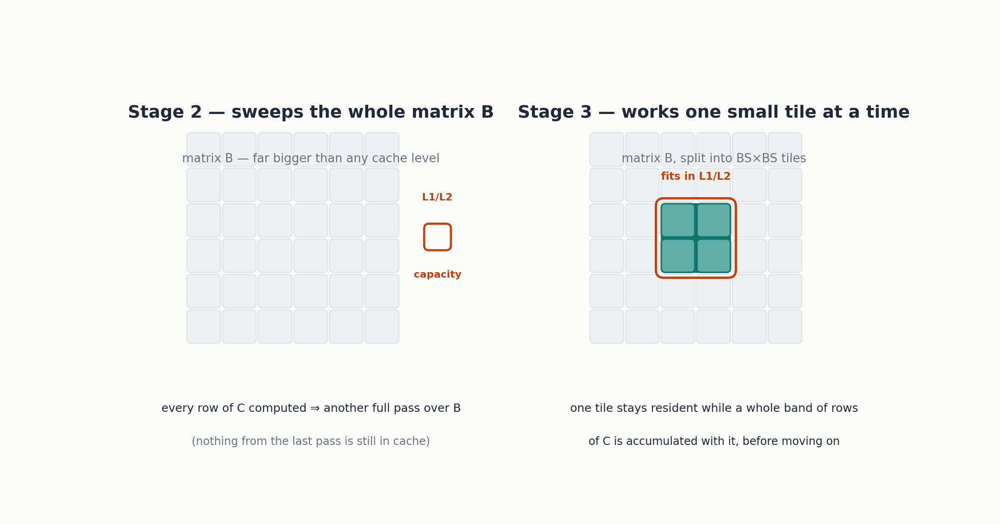
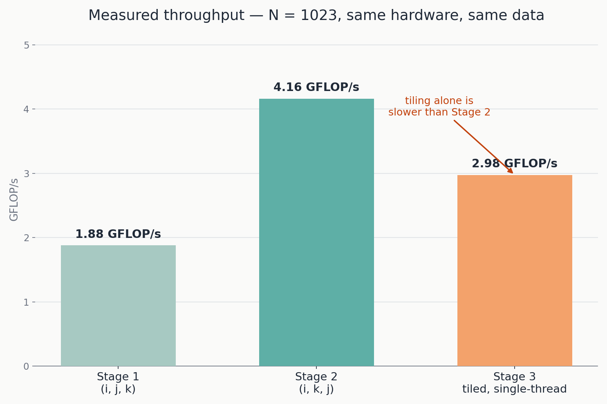
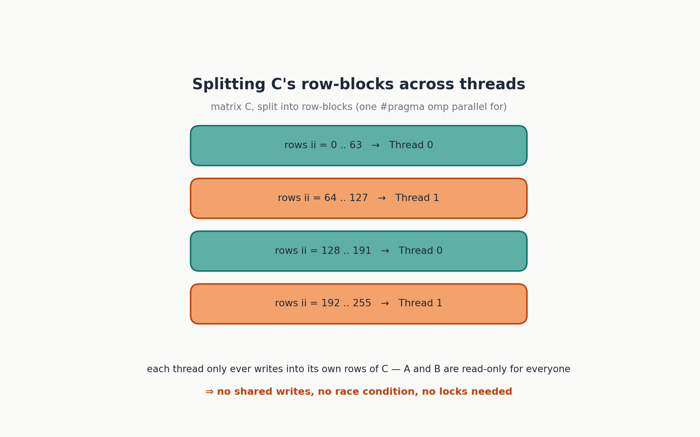
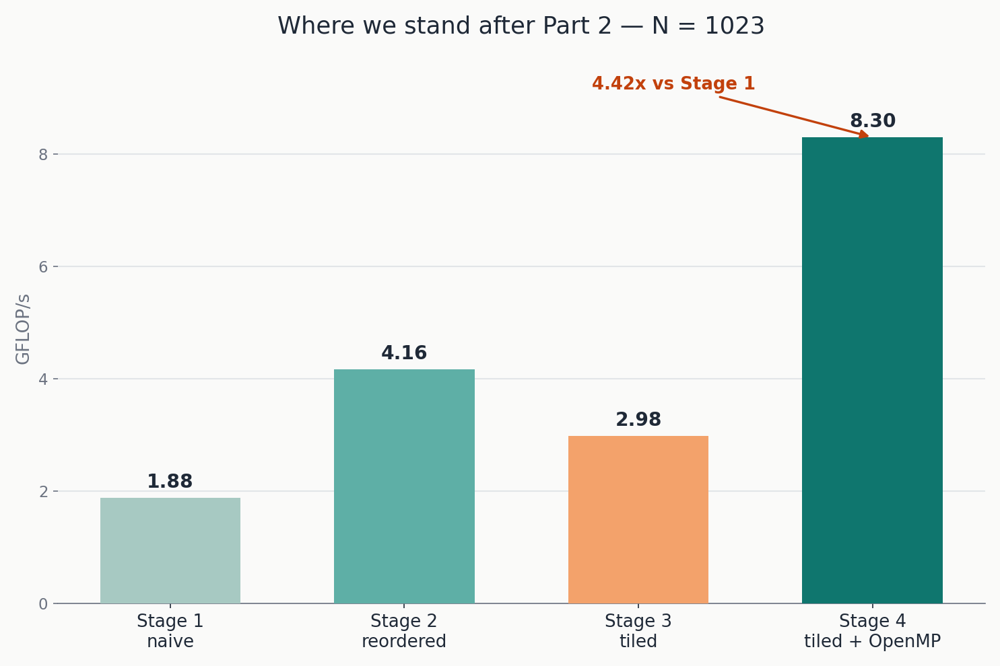

If you read [Part 1](https://kineticcode-dev.github.io/astro-pulsar/blog/matrix-multiplication-optimization-part-1/) of this series, you already know the punch line so far: the exact same matrix multiplication, same algorithm, same number of floating-point operations, went from 1.88 GFLOP/s to 4.16 GFLOP/s just by swapping the order of three `for` loops. Nothing clever, no new hardware feature, just respecting how memory actually gets read.

If you're joining fresh — welcome, and here's the two-sentence version: matrices are stored as one flat, row-major array, and reading that array sequentially is dramatically cheaper than jumping around it, because CPUs fetch memory in cache lines, not single numbers. That single idea is going to keep paying off in this article too, just in two new, less obvious shapes: how you *group* the work you do with each cache line, and how many CPU cores you throw at it.

By the end of this part we'll be sitting at **4.42x** faster than where Part 1 started — but the road there is not a straight line, and the detour is more interesting than the destination.

You can check all the source code to this [link](https://github.com/kineticCode-dev/MatrixMultiplicationOptimization)

## Reordering wasn't the end of the story

Stage 2 fixed the *direction* memory gets walked in. It did not fix a different problem: for every single row of the output matrix C, the reordered loop still sweeps across the *entire* matrix B, top to bottom. B itself, for a 1023×1023 matrix of `double`, is a little over 8 MB. That is nowhere near small enough to fit in L1 cache (tens of KB) or even L2 (a couple MB on most consumer CPUs) — so on every new row of C, the CPU is, in effect, starting from scratch with B, evicting whatever useful data it had just finished loading for the previous row.

This is a different flavor of the same underlying idea from Part 1: spatial locality (walking memory in order) is not the same thing as temporal locality (reusing data you loaded a moment ago, before it gets evicted). Stage 2 nailed the first one. It leaves the second one entirely on the table.

## Tiling: work on a piece small enough to stay put

The fix has a name — **tiling**, sometimes called **blocking** — and the idea, before any code, is almost embarrassingly simple: instead of sweeping across whole rows and columns, chop the matrices into small square **tiles**, sized so that a tile comfortably fits in L1 or L2 cache, and finish all the work that can be done with one tile before moving on to the next.



In code, this means the flat two-loop structure of Stage 2 grows three more loops on the outside — one for each dimension, walked in steps of `BS` (block size) instead of steps of 1:

```cpp
inline void multiply_blocked_ikj(const Matrix& A, const Matrix& B, Matrix& C, int N, int BS = 64) {
    std::fill(C.begin(), C.end(), 0.0);
    for (int ii = 0; ii < N; ii += BS) {
        const int i_max = std::min(ii + BS, N);
        for (int kk = 0; kk < N; kk += BS) {
            const int k_max = std::min(kk + BS, N);
            for (int jj = 0; jj < N; jj += BS) {
                const int j_max = std::min(jj + BS, N);
                for (int i = ii; i < i_max; ++i) {
                    for (int k = kk; k < k_max; ++k) {
                        const double a_ik = A[i * N + k];
                        for (int j = jj; j < j_max; ++j) {
                            C[i * N + j] += a_ik * B[k * N + j];
                        }
                    }
                }
            }
        }
    }
}
```

Look closely and you'll notice the innermost three loops — over i, k, j — are *character-for-character* identical to Stage 2. Nothing about the arithmetic changed. The three new outer loops (`ii`, `kk`, `jj`) just carve the problem into `BS`×`BS` sub-blocks and restrict each pass of the inner loops to working within one sub-block at a time, so that block of B stays small enough to still be sitting in cache the next time it's needed. `std::min(ii + BS, N)` is there purely for correctness — it clips the last, partial tile when N isn't a clean multiple of `BS`.

Compiled and run the same way as before:

```bash
g++ -O2 -std=c++17 stage3_blocked.cpp -o stage3_blocked
./stage3_blocked 1023 64
```

```
Stage 3 - blocked ikj        N=1023   time=  0.7194 s      2.976 GFLOP/s
```

## The surprise: it's slower than Stage 2, not faster

Here it is, in black and white:



If this were a tidy tutorial where every step is a clean win, this number would have quietly been left out, or the block size would have been fudged until it looked better. It isn't going to be. **A measured result that goes the "wrong" way is not a mistake to hide — it's data**, and this particular one teaches something that a monotonically increasing chart never would.

Two things are true at once here, and it's worth pulling them apart.

First, tiling has a real, non-zero cost: six nested loops instead of three, with `std::min` recomputed at every tile boundary. That overhead is only worth paying if the cache misses it eliminates outweigh it by a healthy margin.

Second — and this is the machine-specific part — the L2 cache on the CPU used for these measurements is 2 MB per core. A 1023×1023 matrix of `double` is about 8 MB — far bigger than L2, sure, but Stage 2's *access pattern within one row* was already reasonably cache-friendly to begin with on this particular hardware, leaving less headroom for tiling, on its own, single-threaded, to reclaim. On a CPU with a smaller cache, or on a larger problem, this exact same comparison could easily flip the other way. That's not a caveat to brush past — it's the entire reason this series insists on *measuring*, on your machine, instead of trusting a rule of thumb copied from a blog post (including this one).

**So why keep Stage 3 in the series at all**, if it loses to Stage 2 on its own? Because tiling isn't really about single-threaded speed here — it's about setting up the next move.

```{=comment}
(no-op marker for the two things this article does NOT claim: it does not claim tiling is worthless, and it does not claim this number generalizes to every CPU.)
```

## Splitting the work across cores

A tiled computation has a property Stage 2's flat loop didn't have as cleanly: it's already chopped into independent chunks. And independent chunks of work are exactly what you need to hand off to more than one CPU core.

**OpenMP** is the tool for this, and it is not a library you download separately — it's a compiler feature, enabled with a single flag (`-fopenmp` for GCC and Clang), plus a standard header, `<omp.h>`, that ships with the compiler itself. The way you actually use it, in the overwhelming majority of real code, is through **pragma directives**: special comment-like lines the compiler is told to interpret as instructions rather than ignore. That has a nice side effect — code that uses OpenMP pragmas still compiles and runs correctly without `-fopenmp`; the pragma is simply ignored and the code runs single-threaded.

```cpp
inline void multiply_blocked_parallel(const Matrix& A, const Matrix& B, Matrix& C, int N, int BS = 64) {
    std::fill(C.begin(), C.end(), 0.0);
    #pragma omp parallel for schedule(dynamic)
    for (int ii = 0; ii < N; ii += BS) {
        const int i_max = std::min(ii + BS, N);
        for (int kk = 0; kk < N; kk += BS) {
            const int k_max = std::min(kk + BS, N);
            for (int jj = 0; jj < N; jj += BS) {
                const int j_max = std::min(jj + BS, N);
                for (int i = ii; i < i_max; ++i) {
                    for (int k = kk; k < k_max; ++k) {
                        const double a_ik = A[i * N + k];
                        for (int j = jj; j < j_max; ++j) {
                            C[i * N + j] += a_ik * B[k * N + j];
                        }
                    }
                }
            }
        }
    }
}
```

Compare this against Stage 3 above: it is identical, down to the whitespace, except for one line — `#pragma omp parallel for schedule(dynamic)`, sitting just above the outermost loop over `ii`. That single line tells the compiler: split the iterations of this loop across the available threads, and run them concurrently instead of one after another.

## Why this is actually safe

Slapping a `parallel for` on a loop without thinking it through is one of the most common — and most dangerous-because-intermittent — mistakes in parallel code. If two threads write to the same memory location without coordination, you get a **race condition**, a bug that often doesn't show up on every run, which makes it miserable to debug with a traditional debugger.



Here, it's worth actually walking through *why* it's safe, rather than taking it on faith. The loop being parallelized is the one over `ii` — blocks of *rows* of C. For whichever value of `ii` a given thread is handed, it only ever writes into the rows of C between `ii` and `i_max` — a row range that **no other thread ever touches**, because each value of `ii` is assigned to exactly one thread. There is no shared write on C, and therefore no race condition possible on it. A and B, meanwhile, are only ever *read* by every thread, never written — and concurrent reads of the same data are always safe, no synchronization required.

`schedule(dynamic)` is worth a specific mention too: it tells OpenMP to hand out blocks of iterations to threads as they become free, rather than splitting the work into equal fixed chunks up front. With blocks of fairly uniform size like these, the practical difference from the default static scheduling is small — but `dynamic` is the more robust default in general, since it stays efficient even if the workload per block isn't perfectly even (for instance, the last, partial tile when N isn't a multiple of `BS`).

## Measuring it

```bash
g++ -O2 -std=c++17 -fopenmp stage4_parallel.cpp -o stage4_parallel
./stage4_parallel 1023 64
```

```
OpenMP active: 2 threads available.
Stage 4 - blocked parallel   N=1023   time=  0.2580 s      8.298 GFLOP/s
```



That's a **4.42x** speedup over Stage 1 — worth reading carefully, because at first glance it looks disproportionate for a machine with only 2 cores. The honest comparison isn't against Stage 1, though — it's against Stage 3 (0.719 s), the same tiled algorithm running on a single core: `0.719 / 0.258 ≈ 2.79`, a speedup a bit *above* the theoretical 2x from doubling the core count — likely because splitting the work also eases pressure on the shared L3 cache, a secondary effect stacking on top of the raw parallelism. Against Stage 2 (0.514 s), the more apples-to-apples comparison, the number is a much more believable **1.99x** — almost exactly the doubling you'd expect from 2 cores, and the fairest way to judge "how much did parallelism itself actually buy us" on this particular machine.

**An honest limitation, stated plainly.** These numbers were measured on a machine with only 2 CPU cores. The exact same code — not one line changed — would scale considerably further on a machine with 8 or 16 cores, up to (never quite reaching, thanks to synchronization overhead and shared memory bandwidth) a speedup proportional to the core count. If you have more cores available, rerunning `benchmark_all` yourself is the most direct way to see how much headroom parallelism actually leaves on the table beyond what this specific machine could show.

## What's still on the table

Four honest data points so far: 1.88 → 4.16 → 2.98 (the detour) → 8.30 GFLOP/s. Two big levers are still untouched, and Part 3 picks them both up:

- **Manual vectorization with AVX2 and FMA** — hand-writing the innermost loop with vector instructions that process four `double` values per instruction instead of one.
- **The full comparison, and two more honest surprises** — why a matrix size that happens to be a power of two can run *dramatically* slower than a neighboring size that isn't, and why isolating the effect of aggressive compiler flags from the effect of algorithmic changes turns out to matter almost as much as the algorithm work itself.

The complete, buildable code for every stage in this series — including the ones still to come — lives in the GitHub repository linked from Part 1. Clone it, build it with CMake, and run the numbers on your own hardware; yours will differ from these, and that's exactly the point.
