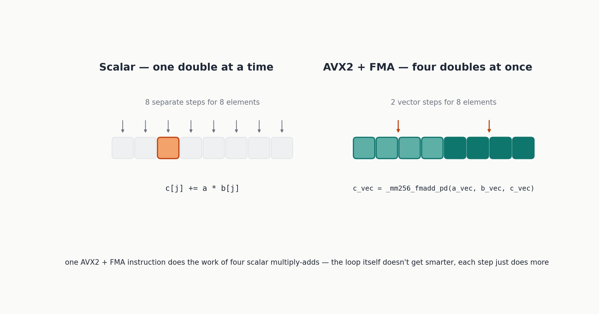
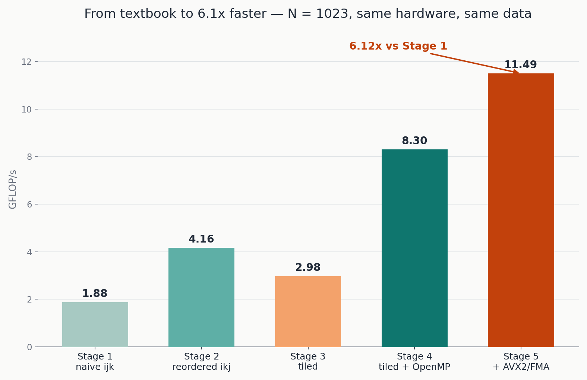
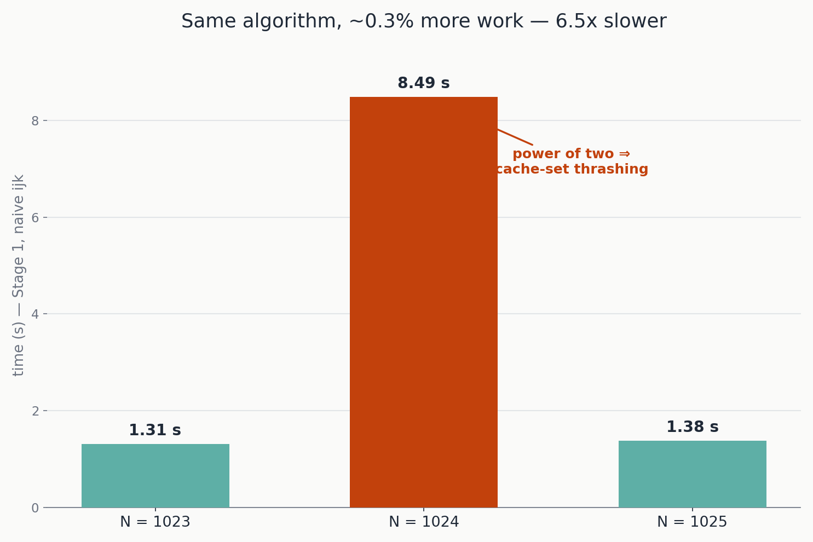
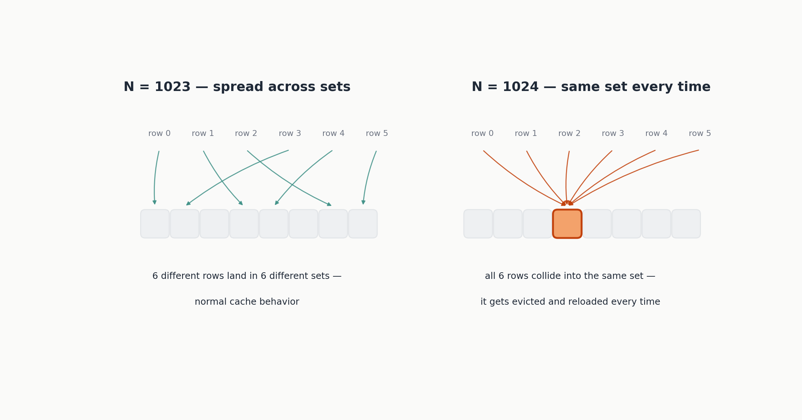
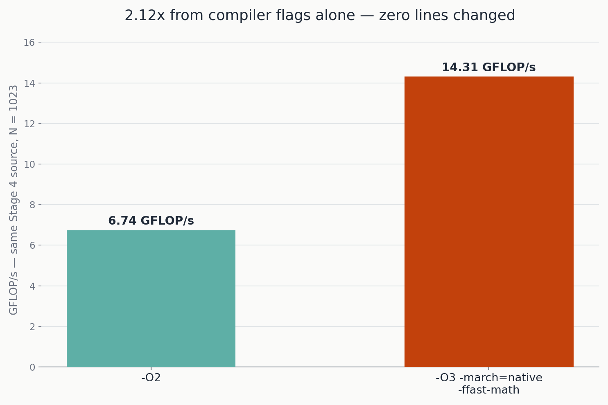

If you've followed along since [Part 1](https://kineticcode-dev.github.io/astro-pulsar/blog/matrix-multiplication-optimization-part-1/), pull up a chair, because this is the one where it all gets tied together. We started at 1.88 GFLOP/s with the matrix multiplication every CS101 course teaches — three nested loops, nothing fancy. [Part 2](https://kineticcode-dev.github.io/astro-pulsar/blog/matrix-multiplication-optimization-part-2/) took us on a detour through tiling (which, measured honestly, made things *worse* on its own) and then to 8.30 GFLOP/s once we put a second CPU core to work with a single OpenMP pragma.

Today we squeeze one more lever — teaching the innermost loop to process four numbers at once instead of one — and then we sit back and look at the whole journey side by side. Along the way, two things showed up in the measurements that had no business surprising anyone who'd read Part 1 carefully, and yet did: a matrix size that's slower than its neighbors for no algorithmic reason at all, and a 2.12x speedup that required changing precisely zero lines of source code.

You can check all the source code to this [link](https://github.com/kineticCode-dev/MatrixMultiplicationOptimization)
## Teaching the CPU to do four multiply-adds at once

Every version so far, at its innermost core, does the same thing: multiply two `double` values, add the result to an accumulator, one number at a time. That's not because the CPU is only capable of one number at a time — it's because we never asked it to do otherwise. Modern CPUs support **SIMD** instructions (Single Instruction, Multiple Data): a single machine instruction that applies the same operation to several numbers simultaneously. The specific SIMD extension we'll use is **AVX2**, which operates on 256-bit registers — wide enough to hold four 64-bit `double` values side by side. Paired with it is **FMA** (Fused Multiply-Add), an instruction that computes `a * b + c` in a single step instead of two separate ones — which happens to be *exactly* the operation sitting in the innermost loop of every stage in this series. It's hard to imagine an instruction more custom-built for this problem.



Where do these instructions come from? Not an external library — they're **intrinsics**, C++ functions declared in the standard `<immintrin.h>` header that ships with every modern GCC, Clang, or MSVC installation. They're thin wrappers that correspond almost one-to-one with individual machine instructions; the compiler translates them directly, with essentially none of the overhead a normal function call would carry.

```cpp
inline void multiply_blocked_avx2(const Matrix& A, const Matrix& B, Matrix& C, int N, int BS = 64) {
    std::fill(C.begin(), C.end(), 0.0);
    #pragma omp parallel for schedule(dynamic)
    for (int ii = 0; ii < N; ii += BS) {
        const int i_max = std::min(ii + BS, N);
        for (int kk = 0; kk < N; kk += BS) {
            const int k_max = std::min(kk + BS, N);
            for (int jj = 0; jj < N; jj += BS) {
                const int j_max = std::min(jj + BS, N);
                for (int i = ii; i < i_max; ++i) {
                    for (int k = kk; k < k_max; ++k) {
                        const double a_ik = A[i * N + k];
                        __m256d a_vec = _mm256_set1_pd(a_ik);

                        int j = jj;
                        for (; j + 4 <= j_max; j += 4) {
                            double* c_ptr = &C[i * N + j];
                            const double* b_ptr = &B[k * N + j];
                            __m256d c_vec = _mm256_loadu_pd(c_ptr);
                            __m256d b_vec = _mm256_loadu_pd(b_ptr);
                            c_vec = _mm256_fmadd_pd(a_vec, b_vec, c_vec);
                            _mm256_storeu_pd(c_ptr, c_vec);
                        }
                        for (; j < j_max; ++j) {
                            C[i * N + j] += a_ik * B[k * N + j];
                        }
                    }
                }
            }
        }
    }
}
```

Start from the outside in: the tiling structure and the OpenMP pragma are **identical** to Stage 4. Vectorization touches only the innermost loop, the one over `j` — so that's the part worth reading line by line.

`__m256d` is the C++ type representing a 256-bit AVX register holding four `double` values. `_mm256_set1_pd(a_ik)` builds a register with `a_ik` repeated four times — necessary because `a_ik` is a plain scalar, constant for the whole sweep over `j` (exactly as in every previous stage), but AVX instructions operate on full registers, so it needs to be "spread" across all four lanes before it can take part in a vector operation.

The loop `for (; j + 4 <= j_max; j += 4)` advances **four at a time** instead of one: each iteration processes four contiguous columns in one shot. `_mm256_loadu_pd` loads four consecutive `double` values from memory into an AVX register (the `u` stands for *unaligned* — it works even when the starting address isn't 32-byte aligned, at a small performance cost relative to the aligned variant; a choice of simplicity and robustness over squeezing out the last percent). `_mm256_fmadd_pd(a_vec, b_vec, c_vec)` computes, in one instruction, `a_vec * b_vec + c_vec` across all four lanes at once — four floating-point multiplications and four additions in a single (ideal) clock cycle. `_mm256_storeu_pd` writes the result back.

The second loop, `for (; j < j_max; ++j)`, is the **scalar tail**: it handles whatever's left over when the current tile's width (`j_max - jj`) isn't an exact multiple of four. With a block size of 64 (always a multiple of 4), this tail only ever fires on N values that aren't themselves a multiple of `BS` — but it has to be there regardless, for correctness on any N and BS someone actually runs.

## A compilation detail you can't skip past

Unlike OpenMP, where forgetting `-fopenmp` still gives you a correct, silently-serial program, forgetting the AVX2 flags here means the code **doesn't compile at all** — `<immintrin.h>` gates its own functions behind macros tied to the compiler flags:

```bash
g++ -O2 -std=c++17 -fopenmp -mavx2 -mfma stage5_avx2.cpp -o stage5_avx2
./stage5_avx2 1023 64
```

```
AVX2/FMA active at compile time.
Stage 5 - blocked AVX2+FMA   N=1023   time=  0.1863 s      11.493 GFLOP/s
```

Against Stage 4 (0.258 s), that's **1.39x faster** — real, but noticeably short of the 4x you might naively expect from "four numbers at once instead of one." That gap deserves an honest explanation rather than a quiet skip: vectorization only speeds up the pure arithmetic. The total wall-clock time also includes memory traffic (still four `double` values per load, not an instant operation) and the block-management overhead around it. A 4x theoretical ceiling applies strictly to the arithmetic portion, not to the whole picture — worth remembering any time a speedup gets estimated on paper before it gets measured for real.

## The full reveal

Five stages, one consistent measurement setup, the same N = 1023 matrix, the same hardware throughout this entire series:

| Stage | Time (s) | GFLOP/s | Speedup vs Stage 1 |
|---|---|---|---|
| Stage 1 — naive ijk | 1.140 | 1.88 | 1.00x |
| Stage 2 — reordered ikj | 0.514 | 4.16 | 2.22x |
| Stage 3 — blocked ikj | 0.719 | 2.98 | 1.58x |
| Stage 4 — blocked + OpenMP | 0.258 | 8.30 | 4.42x |
| Stage 5 — blocked + OpenMP + AVX2/FMA | 0.186 | 11.49 | **6.12x** |



Before trusting that table any further, here's the full disclosure that every one of these numbers deserves: g++ 13.3.0 on Ubuntu, 2 CPU cores available, AVX2/FMA supported in hardware, OpenMP working, `-O2` for every stage except where explicitly stated otherwise (the next section). **A performance number without the hardware and software context it was measured in says almost nothing** — if you rerun this yourself on different hardware, expect different absolute numbers; the relative shape should hold, with the one exception already flagged honestly back in Part 2 for Stage 3.

From barely under 2 GFLOP/s to nearly 11.5 — a factor above six — through four distinct, cumulative changes, each justified by a different underlying principle: memory access order (Stage 2), cache-sized working sets (Stage 3, detour included), multiple cores (Stage 4), vector instructions (Stage 5). Not one of them touched *what* gets computed — only *how*.

## Surprise 1: the power-of-two trap

While putting this series together, something showed up that wasn't planned, and it's too good an example of Part 1's cache theory colliding with practice to leave out. Timing Stage 1 — the plain naive version — on three matrix sizes right next to each other:

```
N = 1023 (not a power of two):  time = 1.309 s
N = 1024 (a power of two):      time = 8.488 s
N = 1025:                       time = 1.382 s
```



**N = 1024 takes almost 6.5x longer than N = 1023 or N = 1025**, despite being barely bigger at all — N = 1024 does about 0.3% more arithmetic than N = 1023. Nothing in $O(N^3)$ complexity theory predicts a cliff like that; it predicts a smooth curve. The explanation is cache-related again, but a more subtle mechanism than the one from Part 1.



Real caches are organized as **set-associative** structures: any given memory address can only land in one specific subset of the available cache lines, determined by the low-order bits of its address. When a matrix row's length is *exactly* a power of two (or a large multiple of one), the addresses that Stage 1's innermost loop touches in sequence — recall, `B[k*N + j]`, with `k` as the loop that jumps by `N` elements each step — repeatedly map onto the **same identical subset** of cache lines instead of spreading out. The result is a **cache conflict miss**: the cache still has free space elsewhere, but that one specific subset keeps getting overwritten, as if the whole cache were far smaller than it actually is.

This effect is specific to Stage 1's stride-N access pattern — precisely the "worst case" access pattern flagged back in Part 1, made pathological by an alignment coincidence. The later stages, with sequential or tiled access, are far less sensitive to it. It's still a useful general lesson: when a matrix or array dimension is under your control and the access pattern isn't purely sequential, avoiding exact powers of two (or padding the row slightly to break the alignment) is a real technique used in production high-performance code, not just a textbook curiosity. Try it yourself if you want to see it firsthand — `./stage1_naive 1023`, then `1024`, then `1025` — it's one of the more immediately convincing experiments this whole series has to offer.

## Surprise 2: isolating the effect of compiler flags

Every measurement so far has held `-O2` constant, specifically so that changes to the algorithm wouldn't get muddled with changes to the compiler's own optimization level. But how much is sitting on the table from the flags alone, source code held completely fixed? Take the Stage 4 source (blocked + OpenMP) — **not a single line changed** — and compile it two different ways:

```bash
g++ -O2 -std=c++17 -fopenmp stage4_parallel.cpp -o stage4_O2
g++ -O3 -march=native -ffast-math -std=c++17 -fopenmp stage4_parallel.cpp -o stage4_O3native
```

`-O3` turns on more aggressive optimizations than `-O2`, including the compiler's own attempt at automatic vectorization. `-march=native` tells the compiler to generate code specific to the exact CPU it's compiling on (including, if available, using AVX2 automatically — no intrinsics required) instead of generic code that runs on any x86 processor — a real trade-off, since the resulting binary may not run at all on a different machine with an older instruction set. `-ffast-math` relaxes some of IEEE 754's strict floating-point rules — specifically, it lets the compiler reorder additions, something it normally can't do because it would change the result by a tiny amount — which is exactly the extra freedom an accumulation loop like ours needs for aggressive auto-vectorization.

```
Stage 4 with -O2:                              0.3176 s     6.741 GFLOP/s
Stage 4 with -O3 -march=native -ffast-math:    0.1497 s    14.308 GFLOP/s
```



**2.12x faster, same exact source file.** Worth putting next to everything else in this series: reordering the loops (Part 1) bought 2.22x. Compiler flags alone, on an already well-written loop, buy another 2.12x — a reminder worth keeping close before sinking time into hand-written optimization: **checking that the compiler flags actually match your target hardware is often the cheapest performance win available**, and it belongs at the start of the process, not as an afterthought once the algorithm has already been rewritten by hand.

We deliberately didn't compile with `-O3 -march=native -ffast-math` from the very first stage in Part 1. Mixing the effect of compiler flags with the effect of algorithmic changes would have made it impossible to tell which of the two was actually responsible for a given improvement — isolating one variable at a time, here the flags against a fixed source, is the same measurement discipline this whole series has tried to model throughout.

## Putting it all together: one benchmark, one repository

Every stage so far has lived in its own small executable — convenient for following along one step at a time, less convenient if you just want to compare all five with a single command. That's what `benchmark_all.cpp` in the repository is for: it builds one pair of input matrices (same seed for every version, so every stage is measured on identical data), computes a reference result once with Stage 1, then runs and times every other version, checking each result against that reference with a `max_abs_diff` correctness check before trusting any of the numbers.

```bash
g++ -O2 -std=c++17 -fopenmp -mavx2 -mfma benchmark_all.cpp -o benchmark_all
./benchmark_all 1023 64
```

It prints the same comparison table shown above — time, GFLOP/s, speedup versus Stage 1, and the maximum error versus the reference (on the order of $10^{-14}$ for every stage, exactly what floating-point rounding predicts) — and writes a `benchmark_results.csv` alongside it, ready for your own charting tool of choice.

The full source for every stage in this series — `common.h`, `kernels.h`, all five `stageN_*.cpp` files, `benchmark_all.cpp`, a `CMakeLists.txt`, and a `build_and_run.sh` — lives in the accompanying GitHub repository, linked from Part 1. Clone it, build it, and run the numbers on your own machine; different CPU, different core count, different compiler, different numbers — and seeing that for yourself is worth more than trusting any table in a blog post, including this one.

## What's still on the table

No honest technical series ends with "and that's everything." A few things were deliberately left out, both for the sake of scope and as a pointer for where to keep going. We didn't touch **Strassen's algorithm** or its relatives, which reduce the asymptotic complexity *below* $O(N^3)$ by changing the algorithm itself, rather than optimizing a fixed algorithm's implementation the way this entire series has. We didn't explore **cache-oblivious algorithms**, which get good cache behavior through recursive divide-and-conquer instead of a hand-picked block size like our `BS` — a more elegant approach in theory, since it never needs to know the target CPU's cache sizes in advance. And we didn't benchmark against a professionally optimized BLAS library (OpenBLAS, Intel MKL, and similar) — it would be honest to expect one of those to still meaningfully beat even Stage 5, being written by specialists and tuned for decades across countless architectures. The point of this series was never to compete with that level of engineering — it was to understand, one measured step at a time, where that kind of performance actually comes from.

## One last thing

The most durable takeaway here isn't the number 6.12x — it's the habit it represents: measure before optimizing, measure again after every single change, verify correctness at every step, and only then draw a conclusion. That habit applies far beyond matrix multiplication — a slow database query, a control loop that keeps missing its cycle time, a vision pipeline that can't keep up with the line, all reward exactly the same discipline. The code changes from one domain to the next. The method — theory to know what to look for, honest measurement to check it, correctness verified at every step — doesn't.

Thanks for sticking around for all three parts. Go measure something.
