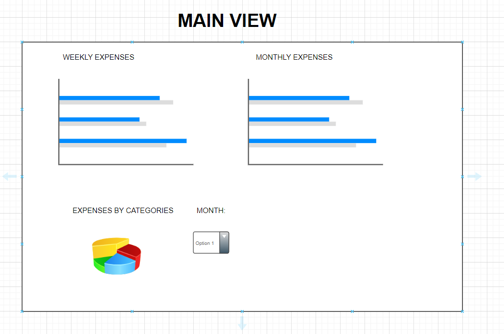
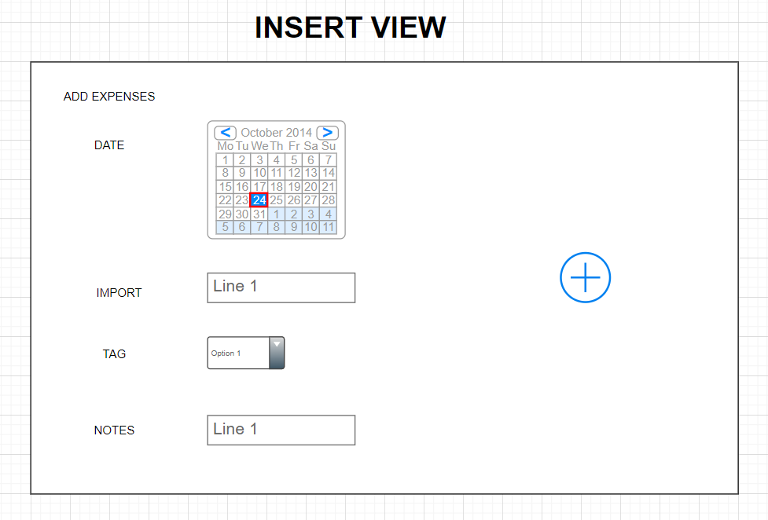
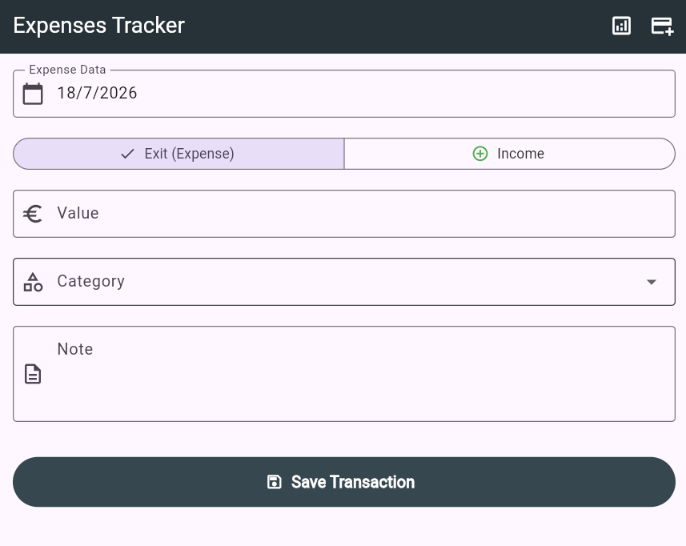
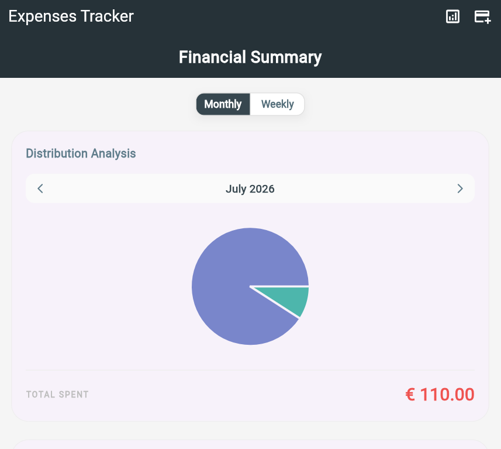
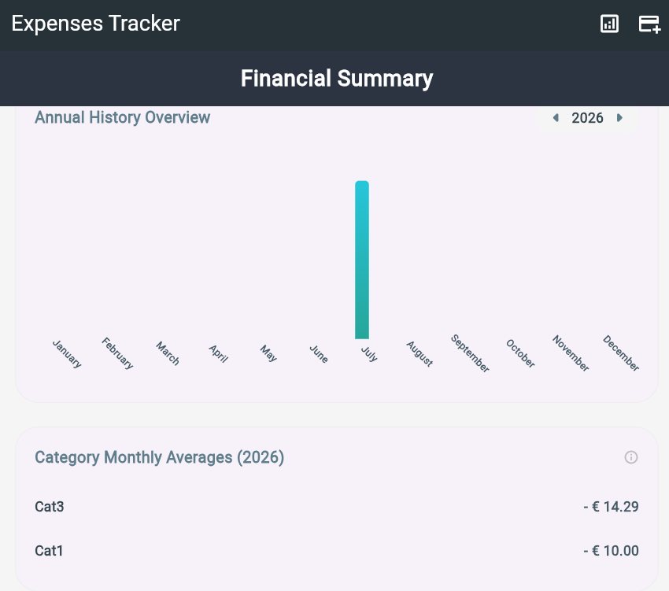

Welcome back! In **Part 2**, we covered the frontend's development using **Flutter**. We set up the project, connected it to our cloud database, and started building out the user interface.

[Link to Github Repository](https://github.com/kineticCode-dev/03-webappTrackingSpeseDummy)

# Webapp Mockups
The webapp will be made of two different screens:
* A dashboard: where we will show bar charts and pie charts.
* An insert screen: where we can add expenses to our database.

The dashboard mockup looks like this:


The insert view mockup looks like this:


## Developing the Insert View
In this section, we will develop the insert view that allows us to add an expense to the database.
The user will need to input:
* The amount of the expense/income. Expenses will be inserted as negative amounts, and incomes as positive amounts.
* The date when the expense happened.
* The category it belongs to.
* Notes.

The final interface looks like this:


## Developing the Dashboard View
Now we will develop the Dashboard View, which will be the summary screen of our finances. The idea is to insert some charts to show our financial status immediately. We must consider that it will be used mainly from mobile, so the screen will be small. It is very important to organize the space as best as possible. A good idea could be: I show only one chart at a time, and somehow, I have the possibility to change the view.

Let's start by installing the Flutter package that allows us to draw charts:

```bash
$ flutter pub add fl_chart
```

Then we import the package:

```dart 
import 'package:fl_chart/fl_chart.dart';
```

The first chart we will develop will be the one for the current month's expenses. To do this, we will use a classic pie chart.
When calculating monthly expenses, we have two possible approaches:
* I read all the monthly expenses from the database into Flutter, and inside Flutter, I loop expense by expense and calculate what I need, like the final amount and the amount per category.
* I aggregate the data directly inside the database and manipulate a part of the data that is already aggregated.

We will follow this second way. This allows us to delegate to the database as much heavy work and filtering as possible, because a database is a tool born exactly to do aggregations.
To do this, we will use a Stored Procedure. A `Stored Procedure`, or `Function`, is a block of code written in SQL language that is saved and executed directly inside the database. We can think of it as a real software function, with input arguments and a return value, that lives on the database server. Every client that connects to the database has these functions available.

Why is it better to use a Stored Procedure in our case? Here are the reasons:
* **Network efficiency:** If a user has recorded 200 expenses in a month, a standard query would download 200 JSON records over the internet. With the stored procedure, the database calculates the sums internally and returns only a few rows (one for each active category, e.g., 5 rows). Fewer data traveling means the app is faster.
* **Performance:** The PostgreSQL SQL engine is highly optimized for looping and aggregating records. Running the sum (`SUM`) and grouping (`GROUP BY`) natively on the server is infinitely faster than doing the same operation by looping a list in Dart on a smartphone's CPU.
* **Overcoming Client API limits:** Supabase client libraries are great for simple CRUD operations, but they don't natively support the SQL `GROUP BY` clause. Creating a function on the database allows us to use all the power of the SQL language (PL/pgSQL) exposing it to Flutter with a very simple call.

All this is also true for weekly expenses, so let's create a generic stored procedure that takes as input:
* year
* month/week
* granularity (monthly/weekly)

And returns, for that specific month/week:
* expense category
* amount

To do this, we go to Supabase, in the SQL editor, and we write this code:

```sql
CREATE OR REPLACE FUNCTION get_aggregated_expenses(
    req_year INT,
    req_value INT, -- Month (1-12) or week (1-53)
    time_frame TEXT -- Could be 'monthly' or 'weekly'
)
RETURNS TABLE (category_name TEXT, total_amount NUMERIC) AS $$
BEGIN
    IF time_frame = 'weekly' THEN
        RETURN QUERY
        SELECT
            t.name::TEXT as category_name,
            SUM(e.importo)::NUMERIC as total_amount
        FROM expenses e
        JOIN tag t ON e.id_tag = t.id
        WHERE EXTRACT(YEAR FROM e.data) = req_year
          AND EXTRACT(WEEK FROM e.data) = req_value
        GROUP BY t.name;
    ELSE
        RETURN QUERY
        SELECT
            t.name::TEXT as category_name,
            SUM(e.importo)::NUMERIC as total_amount
        FROM expenses e
        JOIN tag t ON e.id_tag = t.id
        WHERE EXTRACT(YEAR FROM e.data) = req_year
          AND EXTRACT(MONTH FROM e.data) = req_value
        GROUP BY t.name;
    END IF;
END;
$$ LANGUAGE plpgsql;
```

Client-side, to know the list of expenses for a specific month, we just need to do:

```sql
SELECT * FROM get_aggregated_expenses(2026, 7, 'monthly');
```

And to know the list of expenses for a specific week:

```sql
SELECT * FROM get_aggregated_expenses(2026, 28, 'weekly');
```

And the database will reply with the requested data.

The Final Dashboard looks like this:





## Publishing the webapp online
To host our Flutter web app, we will use GitHub Pages as a hosting service for a static site, which is completely free. Once compiled, our webapp is nothing more than a set of `HTML, CSS, JavaScript, and asset` files.

Let's see the steps to do it. The prerequisites are:
* A GitHub account
* Git installed on the PC
* The webapp build

### Step 1: Change the `base href` in Flutter
Let's open the terminal at the root of the Flutter project, where the `pubspec.yaml` file is located, and run the following command in the terminal:
```bash
flutter build web --release --base-href "/<name-of-your-repo>/" --pwa-strategy=none
```

At this point, the compilation will start inside the `/build/web` folder. When it's done, we will find the files `index.html`, `main.dart.js`, `flutter_bootstrap.js` and `flutter_service_worker.js`.

### Step 2: Create the Repository on GitHub
1. Go to GitHub and create a new repository.
2. Choose the name (the same one used in the `--base-href`).
3. Set the repository as public, which is necessary to have GitHub Pages for free.
4. Leave the options "`Add a README`" or "`.gitignore`" unchecked.

### Step 3: The 404 trick for SPAs
To solve the problem with page refreshes, we apply the following solution:
1. We navigate to the `build/web` folder on our PC.
2. We duplicate the `index.html` file and rename it to `404.html`.
In this way, if a user reloads the page on a deep URL, GitHub will not find the page, it will load the `404.html` file (which is identical to `index.html`), and Flutter will take control by reading the URL and taking the user to the correct screen.

### Step 4: Upload files
We add the whole `build/web` folder to the newly created GitHub repository.

### Step 5: Enable GitHub Pages
1. Let's go to our GitHub repository.
2. Click on **Settings** at the top right.
3. In the left menu, click on **Pages**.
4. Under **Build and deployment**, we set the source to **Deploy from a branch**.
5. Under **Branch**, we select `main` and the `/ (root)` folder, then we click on **Save**.
6. GitHub Actions will build the page. We will find the final URL at the top of the same Pages section as soon as the process is finished, it takes a couple of minutes.
